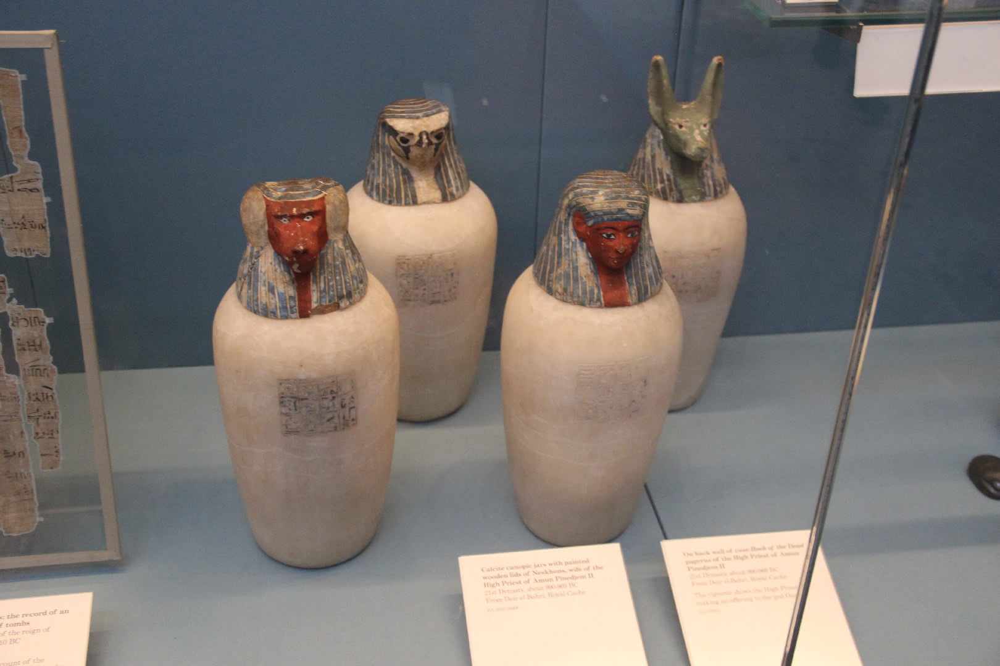
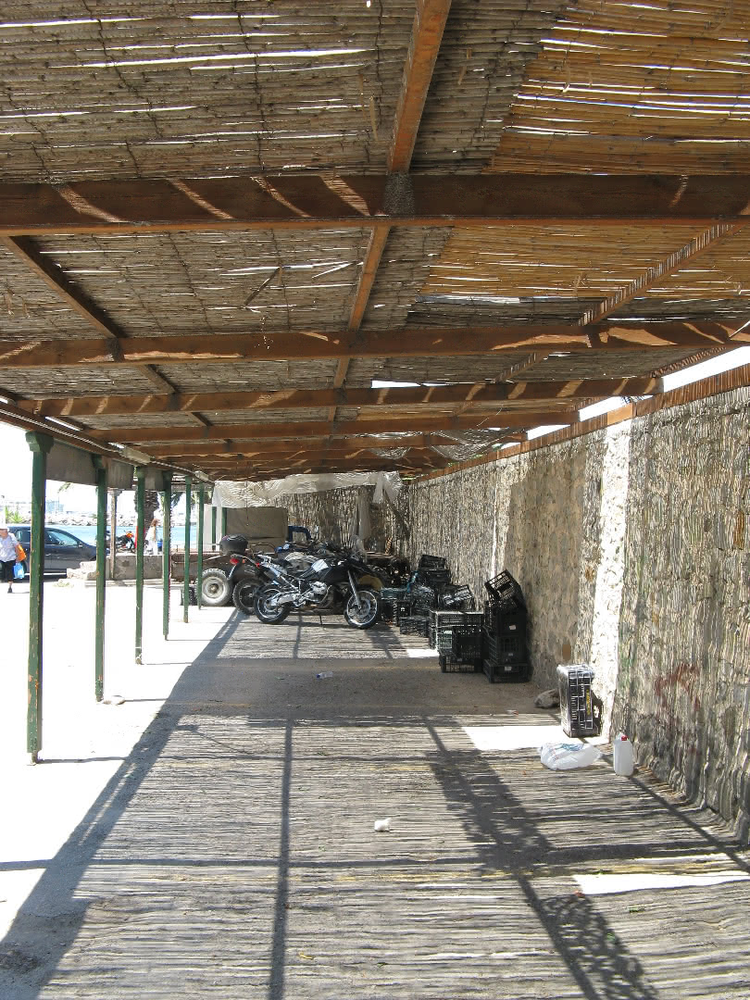
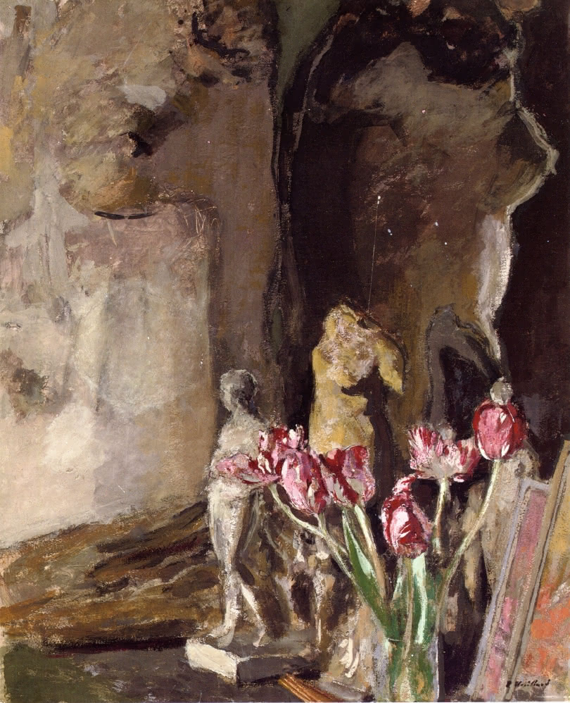
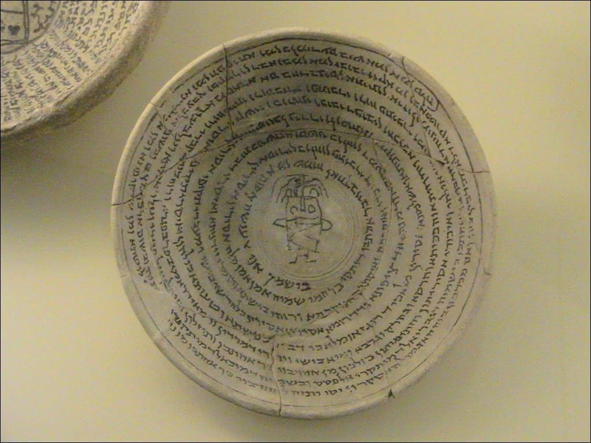

<link rel="stylesheet" href="https://cdn.jsdelivr.net/npm/justifiedGallery@3.8.1/dist/css/justifiedGallery.css" />
<link rel="stylesheet" href="https://cdn.jsdelivr.net/npm/lightgallery@2.7.0/css/lightgallery.css" />
<link rel="stylesheet" href="https://cdn.jsdelivr.net/npm/lightgallery@2.7.0/css/lg-thumbnail.css" />
<link rel="stylesheet" href="https://cdn.jsdelivr.net/npm/lightgallery@2.7.1/css/lg-zoom.css">
<link rel="stylesheet" href="../../style/lg-image.css">

    <a href="amphissa/Caffa.jpg"
        data-slide-name="Caffa"
        data-sub-html="

            <h4>Caffa ⚪卡法 ⚫黑海城邦热那亚的贸易殖民地之一</h4>
            
.img by <a href='https://www.flickr.com/photos/alexxx-malev/' target='_blank' rel='noopener'>Alexxx Malev</a> on <a href='https://www.flickr.com/photos/alexxx-malev/9425207482/' target='_blank' rel='noopener'>Flickr</a> / <a href='https://creativecommons.org/licenses/by-sa/2.0/' target='_blank' rel='noopener'>cc by-sa 2.0</a>

        
">
        
    </a>
    <a href="amphissa/Bacchus_and_Ariadne.jpg"
        data-slide-name="Bacchus_and_Ariadne"
        data-sub-html="

            <h4>巴库斯与阿里阿德涅 ⚪凯尔特语glas是形容山间湖泊的颜色 涵盖从棕绿直到蓝色 ⚫在这里 围巾是朱砂 长袍是群青或雄黄 海是铜绿</h4>
            
Bacchus and Ariadne(1520–1523) - Tiziano Vecelli

        
">
        
    </a>
    <a href="amphissa/Egyptian_Shabtis_&_Amulets.jpg"
        data-slide-name="Egyptian_Shabtis_&_Amulets"
        data-sub-html="

            <h4>shabtis & amulets ⚪沙布提 ⚫一种丧葬雕像 用以充当死者的仆从或佣人 代答命令 代劳在下界的农事等 ⚫可以是木雕,石雕,彩陶等 铭文通常含亡灵书第六章的内容 ⚫阿诺德·范·杰内普将与死亡有关的过渡仪式分为三个时段 包括抬尸一类的分离仪式,守灵一类的边缘仪式,吃斋一类的聚集仪式 ⚫按教会说法 死去圣徒的精神渗透了其衣物,骸骨,头发等遗物 而圣物具有治病,授产,赐福等能力</h4>
            
.img by <a href='https://www.flickr.com/photos/101561334@N08/' target='_blank' rel='noopener'>Gary Todd</a> on <a href='https://www.flickr.com/photos/101561334@N08/36608253515/' target='_blank' rel='noopener'>Flickr</a> / <a href='https://creativecommons.org/publicdomain/zero/1.0/' target='_blank' rel='noopener'>cc 0</a>

        
">
        
    </a>
    <a href="amphissa/women_saints.jpg"
        data-slide-name="women_saints"
        data-sub-html="

            <h4>修道院圣徒画 ⚪Mary Magdalene ⚫抹大拉的马利亚和罐子 装着涂过耶稣的脚的油膏 ⚪St Catherine ⚫亚历山大的圣凯瑟琳和损坏的磔轮,斩首她的剑 ⚪St Scholastica ⚫圣斯科拉斯蒂卡和圣本笃准则,她化身的鸽子 ⚪St Margaret ⚫安条克的圣玛格丽特和逃脱的吞食她的龙 ⚪St Barbara ⚫圣芭芭拉和将她幽禁的塔</h4>
            
at Arbroath Abbey, .img by <a href='https://www.flickr.com/photos/pelegrino/' target='_blank' rel='noopener'>Nick Thompson</a> on <a href='https://www.flickr.com/photos/pelegrino/831620494/' target='_blank' rel='noopener'>flickr</a> / <a href='https://creativecommons.org/licenses/by-nc/2.0/' target='_blank' rel='noopener'>cc by-nc 2.0</a>

        
">
        
    </a>
    <a href="amphissa/Infantas_Isabella_Clara_Eugenia_and_Catalina_Micaela.jpg"
        data-slide-name="Infantas_Isabella_Clara_Eugenia_and_Catalina_Micaela"
        data-sub-html="

            <h4>宫廷肖像画 ⚫十六世纪的西班牙 皇室的孩童通常被描绘成微型的成人 ⚫这里的裙摆的褶边 是成年女性的服饰的特征</h4>
            
Infantas Isabella Clara Eugenia and Catalina Micaela(1570) - Sofonisba Anguissola

        
">
        
    </a>
    <a href="amphissa/Melon_and_Fruit_Bowl_with_Figs.jpg"
        data-slide-name="Melon_and_Fruit_Bowl_with_Figs"
        data-sub-html="

            <h4>无花果 ⚫申命纪(Deuteronomy)8:8提及的七种果实之一 其余的是小麦,大麦,葡萄,无花果,橄榄,椰枣或蜂蜜 ⚫虚构作品阿达拉里称其是眼泪和长眠之树</h4>
            
Melon and Fruit Bowl with Figs(1880-1882) - Gustave Caillebotte

        
">
        
    </a>
    <a href="amphissa/Young_Woman_Playing_a_Guitar.jpg"
        data-slide-name="Young_Woman_Playing_a_Guitar"
        data-sub-html="

            <h4>baroque guitar ⚪巴洛克吉他 ⚫一种弦乐 取代了文艺复兴时期的鲁特琴 ⚫可以装饰象牙,乌木,龟甲,珍珠母等 ⚫音孔由多层卷纸制作 ⚫这里的人物穿戴着一件貂皮镶边的黄夹克,一件象牙色的缎面连衣裙,一条珍珠项链</h4>
            
Young Woman Playing a Guitar(1672) - Johannes Vermeer

        
">
        
    </a>
    <a href="amphissa/Egyptian_calcite_Canopic_jars.jpg"
        data-slide-name="Egyptian_calcite_Canopic_jars"
        data-sub-html="

            <h4>calcite Canopic jar ⚪卡诺卜罐 ⚫发掘于尼罗河三角洲的卡诺普斯 ⚪该地名来自希腊人的传说 是迈锡尼国王阿伽门农(Agamemnon)的弟弟梅内劳斯(Menelaus)的航海家 斯巴达军队远征特洛伊时的船长 早期的埃及学者误以为他在死后以这些罐子的形式被崇拜着 就使用了这个称呼 ⚪Canopus ⚪也是冬季星空或南天星空一颗一等星的名字 拉丁化为船底座α ⚫到第十八王朝后期 坛盖所刻模样和保存的器官分别是 狼首(胃),隼头(肠),狒狒首(肺),人首(肝)</h4>
            
.img by <a href='https://www.flickr.com/photos/101561334@N08/' target='_blank' rel='noopener'>Gary Todd</a> on <a href='https://www.flickr.com/photos/101561334@N08/35772374954' target='_blank' rel='noopener'>flickr</a> / <a href='https://creativecommons.org/publicdomain/zero/1.0/' target='_blank' rel='noopener'>pdm</a>

        
">
        
    </a>
    <a href="amphissa/the_Piacenza_Liver.jpg"
        data-slide-name="the_Piacenza_Liver"
        data-sub-html="

            <h4>the Piacenza Liver ⚪青铜羊肝 ⚫肝脏被古巴比伦人认为是血液的来源 在尼尼微的巴尼拔图书馆里记载有十多个与其相关的术语 ⚪狩猎或牺牲动物 取出其肠,肝进行占卜 也称为脏卜 ⚫在北方国家 鹅卵石迷宫被认为是结肠的模型 这类旋径既是朝向下界的 代表了回归大地母胎的受庇护的渴望 也朝向天空 也就是向着神的深渊坠落 ⚫在第三本先知书以西结书21:26里 尼布甲尼撒(Nebuchadnezzar II)在岔路前摇箭,求问舞偶(teraphim),察看肝卜 ⚪teraphim(特拉芬) ⚪希伯来语单词 仅以复数形式出现在旧约圣经(Tanakh) 但可以指称单数对象 ⚫是占卜器物,戏剧木偶,小型家神像 ⚫作占卜时通常32个一组 类似于西洋棋来布置 不能单独使用 需查看移动中的棋像的相对关系 其三十二轨也是祭司的舞步步径</h4>
            
.img by <a href='https://www.flickr.com/photos/bramhall/' target='_blank' rel='noopener'>David Bramhall</a> on <a href='https://www.flickr.com/photos/bramhall/18906923560' target='_blank' rel='noopener'>flickr</a> / <a href='https://creativecommons.org/licenses/by-nc-nd/2.0/' target='_blank' rel='noopener'>cc by-nc-nd 2.0</a>

        
">
        
    </a>
    <a href="amphissa/the_Siren_of_Canosa.jpg"
        data-slide-name="the_Siren_of_Canosa"
        data-sub-html="

            <h4>the Siren of Canosa ⚪塞壬 ⚫卡诺萨的塞壬小雕像具有一些渡神(psychopomp)的特征 可用于葬礼 ⚪siren的词源存在争议 一个古希腊底语的起源里 被认为和seira(绳子)和eiro(系)有关 英语中可指一种制造噪音的装置 ⚫拜占庭的史蒂芬努斯记述到 克里特西北海岸的阿普特拉(Aptera)城的歌赛上 塞壬在输给了缪斯(Muse)们后 白化并掉入无羽海 形成了卢凯(Leukai)岛 在今天是苏达(Souda)岛和利昂(Leon)岛 ⚪aptera和leukai意思就是没有羽毛和白色的事物 ⚫它们会演奏各种乐器 通常是竖琴,里拉琴(lyre) ⚫亚撒纳修斯·基彻(Athanasius Kircher)认为在诺亚方舟上一定要为它们建造隔间</h4>
            
.img by <a href='https://www.flickr.com/photos/zaqarbal/' target='_blank' rel='noopener'>Luis García</a> on <a href='https://www.flickr.com/photos/zaqarbal/2388945210' target='_blank' rel='noopener'>flickr</a> / <a href='https://creativecommons.org/licenses/by-sa/2.0/' target='_blank' rel='noopener'>cc by-sa 2.0</a>

        
">
        
    </a>
    <a href="amphissa/Lady_on_a_Balcony,_Capri.jpg"
        data-slide-name="Lady_on_a_Balcony,_Capri"
        data-sub-html="

            <h4>Capri ⚪卡普里 ⚪是岛名和小镇名 ⚫夏季到访的游客很多 尤其是一日游的 ⚪以当地命名的卡普里裤 可以通称任何长到脚踝以上的裤子 ⚫与半岛上的索伦托(Sorrento)小镇相望 后者以小陶瓷,蕾丝织品,镶嵌木具闻名 引进有橙子,柠檬种植</h4>
            
Lady on a Balcony, Capri(1889) - John William Waterhouse

        
">
        
    </a>
    <a href="amphissa/Way_of_Salvation,_Church_Militant_and_Triumphant.jpg"
        data-slide-name="Way_of_Salvation,_Church_Militant_and_Triumphant"
        data-sub-html="

            <h4>nominalism ⚪唯名论 ⚪源于拉丁语nomen(name) 约翰·斯图尔特·米尔在某篇论文里总结其含义 除非具名 否则一般事物并不存在 ⚫一般否认存在共相(以实例化事物) 它仅是文学概念 或者否认存在抽象事物(从时空上) ⚫代表人物有奥卡姆(Ockham) 画中他戴着一顶黄色的小瓜帽 ⚫与之分歧的 最早可追溯到柏拉图式的实在论(realismus) ⚪这个词词源自晚期拉丁语realis(真实) ⚫其中一些重要概念可能是 人是从不可接触的完全中抽象出不全的副本 来制作实例</h4>
            
Way of Salvation, Church Militant and Triumphant(1365-1367) - Andrea di Bonaiuto

        
">
        
    </a>
    <a href="amphissa/Portrait_of_a_Young_Girl.jpg"
        data-slide-name="Portrait_of_a_Young_Girl"
        data-sub-html="

            <h4>portrait ⚪肖像 ⚫4:3是标准的肖像比例  ⚪landscape ⚫指一块空地 古英语中的同源术语是landscaef,landskipe 但在17世纪初由荷兰语landschap英语化而来 属绘画,艺术品相关的术语 ⚫伊曼纽尔·列维纳斯(Emmanuel Levinas)的伦理概念的重要部分之一是关于另一方的接近 他在存在对于他人里写到 并没有普遍的道德法则 只是在他人处于脆弱状态 一种责任感被唤起了 而这种回应受面孔胁迫 并作为道德基础 ⚫他使用本体论(ontology)指代元自然论(metaphysics) ⚪这个词词源是拉丁语meta(自 根源)和physics(自然讲) 后者原指一个归因于亚里士多德的语料库 由罗马时代的校成员保存 在西罗马覆灭后 这些著作幸存于东罗马 并被纳入早期伊斯兰哲学 西欧在中世纪时由两者恢复了亚里士多德学派 一直到文艺复兴时期 这些追随者也被称为回廊学派 得名于原址上的建筑和讲授风格 ⚪构成本体论 ⚫捆束理论认为一个对象不过是它构成的属性 如一个普通的苹果可以被描述成一捆红,圆,甜等 ⚪关系本体论 ⚫注点理论认为 对象是无结构的点 作为该理论的一种 类别唯名论认为 属性是事物的类别 实例化一个属性仅是成为相应类的成员 因此属性不是拥有该属性的事物的构成</h4>
            
Portrait of a Young Girl - Konstantin Yegorovich Makovsky

        
">
        
    </a>
    <a href="amphissa/Aegina.jpg"
        data-slide-name="Aegina"
        data-sub-html="

            <h4>Aegina ⚪爱琴娜 ⚫19世纪末 医生尼古拉斯·佩洛格鲁(Nikolaos Peroglou)在爱琴娜岛引入了开心果的系统栽培 干旱气候,火山土壤 使得农产品的质量优于数个国外品种 到20世纪末 部分品牌通过了原产地保护认证(pdo) ⚫根据梅尼普斯(Menippus)的故事 当年第欧根尼在去该岛的途中被海盗捕获 并在克里特岛作为奴隶卖给了哥林多人</h4>
            
.img by <a href='https://www.flickr.com/photos/spirosk/' target='_blank' rel='noopener'>SpirosK photography</a> on <a href='https://www.flickr.com/photos/spirosk/4826452346/' target='_blank' rel='noopener'>flickr</a> / <a href='https://creativecommons.org/licenses/by-nc-nd/2.0/' target='_blank' rel='noopener'>cc by-nc-nd 2.0</a>

        
">
        
    </a>
    <a href="amphissa/Sinop.jpg"
        data-slide-name="Sinop"
        data-sub-html="

            <h4>Sinop ⚪锡诺普 ⚫在古代 是安纳托利亚西海岸的移民城市米利都(Miletus)的一个殖民地 可能出产一款宝石蓝或橙黄的丝质长罩衫 铸币上起初是海龟 后被陆龟取代 ⚪名字来源于一种叫做sinopia的暗红棕色的天然岩土颜料 这种颜料在卡帕多西亚(Cappadocia)开采 供应古代世界 其红色来自赤铁矿 据说宗主城市也产一种玫瑰色的赭石 ⚫意大利画家和作家塞尼诺·塞尼尼(Cennino Cennini)在他的绘画手册写到 这种颜料 具有轻薄和干燥的特点 碾磨越细 粉化效果越好 非常适合用于镶板,镶隔板,墙面 用于湿壁画,壁画</h4>
            
.img <a href='https://www.flickr.com/photos/donbrr/' target='_blank' rel='noopener'>Don Barrett</a> on <a href='https://www.flickr.com/photos/donbrr/3553112683/' target='_blank' rel='noopener'>flickr</a> / <a href='https://creativecommons.org/licenses/by-nc-nd/2.0/' target='_blank' rel='noopener'>cc by-nc-nd 2.0</a>

        
">
        
    </a>
    <a href="amphissa/Diogenes.jpg"
        data-slide-name="Diogenes"
        data-sub-html="

            <h4>犬儒学派的创始人之一 ⚫考古学上发现了许多污损的硬币 被认为是第欧根尼父子俩故意使其贬值 直到无法作法定货币使用 在他的银行家父亲希切西奥(Hicesias)担任铸币官员的这段时间 市面上还有很多假币流通 这出金融丑闻最终以他被逐出出生地锡诺普(Sinope)收场 连带失去了公民身份和所有财产 ⚫据说他是去德尔菲寻求建议 被告知他应破坏货币 事后 第欧根尼认为先知的意思其实是 他应抹黑政治的货币 而不是实际的硬币 ⚫遭驱逐后 他移居雅典 以挑战既定习俗和价值观作为自己的人生目标 他因居住在属于泰坦神塞贝莱(Cybele)神庙的陶坛里,在白天提灯,在市场上吃东西,在阿卡德米(Academy)学园上课时吃食等行为而著名 ⚫有一些记载是关于他生活在哥林多的克兰姆(Craneum)竞技场附近时 菲利普(Philip II)要来视察的报道使全城一片混乱 一个人在擦亮他的手臂 另一个在抡石块 第三个在补墙 第四个在加固墙垛 每个人都在以某种方式使自己有用 第欧根尼无所事事 当然也没人想过要给他一份差事 但被眼前的景象触动 第欧根尼收起了他的哲学家斗篷 开始大力地把他住的大桶滚上滚下 一位熟人问询并得到了这番解释 我不想被认为是如此繁忙的人群中唯一的闲人 我像其他人一样 我滚着我的大桶 ⚫据说他因生吃章鱼而病死</h4>
            
Diogenes(1882) - John William Waterhouse

        
">
        
    </a>
    <a href="amphissa/byzantine_clothing.jpg"
        data-slide-name="byzantine_clothing"
        data-sub-html="

            <h4>Byzantine clothing ⚪道袍 ⚫在君士坦丁(Constantinus I)主持下 首届普世公会在拜占庭(Byzantine)小镇召开 全体主教签署了具有强制性的尼西亚(Nicae)教条 拒绝签署或者谴责阿里乌的人员被认为受皇帝驱逐 他下令焚毁该教派文献宴席(Thalia)及其副本 其中的规则 有时被称为异构教条 指文件不包含相同实体或相似实体的词的事实 ⚪BIBLE本指许多小书集成的书 现大写来区别于一切世俗书卷 其正典包含旧约39卷 希波(Hippo)公会及后续纳入的新约27卷</h4>
            
.img by <a href='https://www.flickr.com/photos/127226743@N02/' target='_blank' rel='noopener'>Dimitris Kamaras</a> on <a href='https://www.flickr.com/photos/127226743@N02/46197866412/' target='_blank' rel='noopener'>flickr</a> / <a href='https://creativecommons.org/licenses/by/2.0/' target='_blank' rel='noopener'>cc by 2.0</a>

        
">
        
    </a>
    <a href="amphissa/mosaic_niche_from_Baiae_with_a_garden_scene_04.jpg"
        data-slide-name="mosaic_niche_from_Baiae_with_a_garden_scene_04"
        data-sub-html="

            <h4>mosaic niche from Baiae ⚪马赛克壁槽 ⚫古玛(Cumae)城属下的海滨古镇和疗养地拜雅 起初也许是作为半岛的港口开发 ⚫地理志5.4.6中描述了从古玛到拜雅 难闻的气味 因其到处是硫磺,火和热水 ⚫有着最古老的温泉建筑群 如今位于水下 在阿芙罗狄蒂的索桑德拉(Sosandra)浴场的地窖里发现了许多希腊雕塑的石膏模型 说明该地区有着量产艺术仿制品的作坊 ⚫罗马名流克洛迪亚·梅泰利(Clodia Metelli)在一场道德审判中被谴责 在拥挤的度假村拜雅 沉迷于海滩派对和长饮</h4>
            
.img by <a href='https://www.flickr.com/photos/carolemage/' target='_blank' rel='noopener'>Carole Raddato</a> on <a href='https://www.flickr.com/photos/carolemage/16635488033/' target='_blank' rel='noopener'>flickr</a> / <a href='https://creativecommons.org/licenses/by-sa/2.0/' target='_blank' rel='noopener'>cc by-sa 2.0</a>

        
">
        
    </a>
    <a href="amphissa/Tulips_and_Statuettes.jpg"
        data-slide-name="Tulips_and_Statuettes"
        data-sub-html="

            <h4>tulip ⚪郁金香 ⚫被其信徒缩写和代表加尔文教义 ⚪total depravity(全然堕落) ⚪total inability(全然无能) ⚫人无法得救 救恩归于耶和华 ⚪unconditional selection(无条件拣选) ⚫在一切或事情发生前挑选 而不是之后 ⚪limited atonement(有限赎罪) ⚫基督的死偿还了罪孽 但只为上帝的选民 不为所有人 ⚪irresistible grace(不可抗恩典) ⚫神恩无法拒绝 除此别无所求 神意无法违背 ⚪perseverence of the saints(圣徒的坚守) ⚫被上帝区别于他人的圣徒 将存信仰至最后</h4>
            
Tulips and Statuettes(1919) - Edouard Vuillard

        
">
        
    </a>
    <a href="amphissa/folio_from_a_Shahnama.jpg"
        data-slide-name="folio_from_a_Shahnama"
        data-sub-html="

            <h4>folio from a Shahnama ⚪开页 ⚫费多西书写的波斯长史诗沙南(Shahnameh)的抄本 其中有对琐罗亚斯德教起止的追溯 开本现散布在私人和公共收藏中 ⚫希尔万沙(Shirvanshah)宫的诗人卡加尼对此写到烛火撑起夜的帷幔 小径婆娑 映照灰色花园 ⚫其他的朝臣,宫廷艺人可能有火技魔术师,驯犬小丑 ⚫传闻伪典翡翠碑记载的 上即下下即上 首次出现在六至八世纪间的阿拉伯文献中 十二世纪时被西班牙神职译成拉丁语 之后由艾萨克·牛顿私下研究炼金术时转译为英语 这些手稿仅存几张残页 据说在一场火灾事故中连带其他的资料付之一炬 因为他养的小狐狸犬代门(Diamond)打翻了蜡烛</h4>
            
.img on <a href='https://www.metmuseum.org/art/collection/search/447300' target='_blank' rel='noopener'>metmuseum</a> / <a href='https://creativecommons.org/publicdomain/zero/1.0/' target='_blank' rel='noopener'>cc 0</a>

        
">
        
    </a>
    <a href="amphissa/The_Death_of_King_Arthur.jpg"
        data-slide-name="The_Death_of_King_Arthur"
        data-sub-html="

            <h4>亚瑟王之死 ⚫伪地方纪事不列颠史记载 将领亚瑟陷于卡姆兰战场 同莫德雷德决斗 双双丧生 在后来对其添枝加叶的不列颠诸王史里 他作为亚瑟王 被女巫们带到阿瓦隆(Avalon)岛疗养 由姐姐摩根(Morgan)医治 画幅中她头戴黑头巾 ⚫另外 王都凯尔利昂(Caerleon)会举办竞技赛 亚瑟王则遵循封建道德 赠与骑士们城市,城堡,教会职位等财产 而纹章同时是是身份地位的符号,控制或拥有的标记,装饰 ⚪最早的拼写Morgen可能源自古威尔士或古不列吞词 意思是海生的 在古爱尔兰语里的同源词是Muirgen 据说是携带着一条水獭的人鱼被一艘信使的兽皮小圆舟发现 在约定的一年后 她上岸并受洗了这个基督化的名字 有相对较新的说法是 某个亚瑟王原型候选人的姊妹叫作Maithgen 也与另一个圣徒故事中的某个德鲁伊先知同名 ⚫诸多派生散文和诗歌中 据说乘舟同行的还有她的导师梅林的冤家 湖妖公主尼姆(Nimue)和女猎人薇薇安(Niviane) 据说她还是数学家 教授另外八姊妹天文知识 治理着自给自足的阿瓦隆岛 ⚪即威尔士语中 苹果之岛 ⚫在十四世纪末的中古英语诗歌骑士小说高文(Gawain)与绿骑士里 摩根勒菲(Morgan le Fay)设下圈套 在卡美洛(Camelot)宫廷的圣诞夜 令大姐安娜·摩高斯(Anna Morgause)之子高文接受绿骑士挑战 将其斩首 次年冬天 高文前往绿教堂赴受斧之约 途中接受了绿腰带 折返时将其带回</h4>
            
The Death of King Arthur(1860) - James Archer

        
">
        
    </a>
    <a href="amphissa/the_Lewis_chessmen.jpg"
        data-slide-name="the_Lewis_chessmen"
        data-sub-html="

            <h4>the Lewis chessmen ⚪刘易斯岛棋子 ⚫由海象牙和一些鲸牙雕刻成</h4>
            
.img by <a href='https://www.flickr.com/photos/allan_harris/' target='_blank' rel='noopener'>Allan Harris</a> on <a href='https://www.flickr.com/photos/allan_harris/4554721705/' target='_blank' rel='noopener'>flickr</a> / <a href='https://creativecommons.org/licenses/by-nd/2.0/' target='_blank' rel='noopener'>cc by-nd 2.0</a>

        
">
        
    </a>
    <a href="amphissa/shellac.jpg"
        data-slide-name="shellac"
        data-sub-html="

            <h4>mould of the bust of Madame du Barry by Augustin Pajou ⚫半身像模具 使用灰泥和虫胶制成 ⚪shellac(虫胶) ⚪罗曼语和希腊语除外的大多数欧洲语言都挪用该英语词 或德语词 仿译于法语词 薄板中的胶 ⚫一种胶蚧雌虫分泌的树脂 从树上刮下后装入帆布袜筒 火烤 渗出液化的虫胶 滤掉树皮屑和虫子 再凝成纽扣状保存 ⚫受树液和采集季节影响 呈铂色,石榴石等暖色 未脱蜡时的液体呈乳白色 ⚫使用前先粉碎 溶解于酒精时 保质期通常为一年 冷藏时可延长 其涂层有良好的耐久,硬度,密封性,光泽 可作家具清漆 ⚫克里斯·伍兹的蜡和虫胶的性质和处理(The nature and treatment of wax and shellac seals)讨论了蜂蜡混合虫胶作密封蜡等配方 可代替柑橘类水果在清洁时洗掉的蜡质 赋予光泽 延长保质期 ⚫作药用釉料时 作赋形剂 由于其酸性 涂层药物可抗胃酸 并定时肠溶 作食品釉料时 作抛光剂,着色剂 ⚫作烟火的低温燃剂时 产生纯净的蓝,绿</h4>
            
.img by <a href='https://commons.wikimedia.org/wiki/User:Coyau' target='_blank' rel='noopener'>Coyau</a> on <a href='https://commons.wikimedia.org/wiki/File:S%C3%A8vres_-_Magot_-_Pajou,_buste_de_Madame_du_Barry_03.jpg' target='_blank' rel='noopener'>wikicommons</a> / <a href='https://creativecommons.org/licenses/by-sa/3.0/' target='_blank' rel='noopener'>cc by-sa 3.0</a>

        
">
        
    </a>
    <a href="amphissa/The_Babylonian_Marriage_Market.jpg"
        data-slide-name="The_Babylonian_Marriage_Market"
        data-sub-html="

            <h4>巴比伦婚姻市场 ⚫中世纪到文艺复兴 法规限制了特定织物,饮食物,奢侈品的获得者 以防任何人伪装成贵族 那些停滞的中产上层则与女继承人结婚 或者咨询婚姻经纪人 来规划,重塑家族历史 这些大家族内 没有以利于氏族方式结婚的女儿通常被送入女修道院 ⚫直到英王与阿拉贡的凯瑟琳离婚并脱离罗马天主教廷 解散并售出其寺院 迎娶安妮·博林 之后 她们中的部分会去到宫廷 成为伊丽莎白(Elizabeth I)和贵族间优雅的线和缓冲带 受她应予婚姻 ⚫该时代的戏剧发端于中世纪奇迹剧和在修道院庭院演出的圣经故事</h4>
            
The Babylonian Marriage Market(1875) - Edwin Long

        
">
        
    </a>
    <a href="amphissa/northern_signs_of_the_zodiac_and_constellations.jpg"
        data-slide-name="northern_signs_of_the_zodiac_and_constellations"
        data-sub-html="

            <h4>北天星象 ⚫密特拉教由于几乎没有书面说明而需从考古证据重建 某位学者辩称这位波斯太阳神是主持岁差的人格化 被献祭的动物 对应着太阳(春分点)移出小犬座(Canis Minor),长蛇座(Hydra),乌鸦座(Corvus),天蝎宫(Scorpius),金牛宫(Taurus)</h4>
            
.img by <a href='https://www.flickr.com/photos/britishlibrary/' target='_blank' rel='noopener'>British Library</a> on <a href='https://www.flickr.com/photos/britishlibrary/11226153094/' target='_blank' rel='noopener'>flickr</a> / <a href='https://creativecommons.org/publicdomain/mark/1.0/' target='_blank' rel='noopener'>pdm</a>

        
">
        
    </a>
    <a href="amphissa/Death_of_Orpheus.jpg"
        data-slide-name="Death_of_Orpheus"
        data-sub-html="

            <h4>奥菲斯之死 ⚫在欧里庇得斯的戏剧巴克斯(The Bacchae)里 色雷斯人,神话诗人奥菲斯死于一队对其感到厌烦的梅纳德 ⚫秘宗奥菲斯教所记述的神统 虽与编年史家赫西俄德的神谱是相似的系谱学作品 但有着截然不同的释义和编排 该教教义中奉冥后普西芬妮(Persephone)和狄俄尼索斯为主神 并有着一尊仁慈与光明的太古初神二元一体的法涅斯(Phanes) 后者等同于新柏拉图式秘宗密特拉教的密特拉斯(Mithras) 它们在古典晚期与早期基督教 在传教上是彼此竞逐的关系 ⚫这些异教神祇身上那些薄若蝉翼的遮掩物也称做玻璃衣裳</h4>
            
Death of Orpheus(1866) - Emile Levy

        
">
        
    </a>
    <a href="amphissa/Market_Gate_of_Miletus.jpg"
        data-slide-name="Market_Gate_of_Miletus"
        data-sub-html="

            <h4>market gate of Miletus ⚪市场大门 ⚫据说在圣艾琳(Irene)岛硫冬后 入侵了克里特岛(Caphtor)的迈锡尼人被多利安人赶到海岸和丘陵地带阿提卡 阿提卡人在海上贸易和归乡途间 习得了西亚技艺 重新发掘了故乡漫山遍野的物产 ⚫在这座伊甸 葡萄酒,橄榄油盛满了陶土罐 花岗岩落成庙宇和雕像 银矿浇铸为雅典钱币广为流通 于是色雷斯(Thrace)神祇狄俄尼索斯飘洋过海 ⚪雅典哲学和历史学家色诺芬挪用了古伊朗语par-dēz 围绕,墙或砖块 意为围墙内的花园或场所 作为旧约中伊甸园的译文 通常用高墙封闭 以提供阴影和保护 相比帐篷 提供了更固久的庇护所 特别是在干旱气候 早期希伯来人用这个词表示果园 ⚫据说某东海岸城市欲引进酒神崇拜 受到了德尔菲女先知的邀请 去返圣城底比斯(Thebes) 卡德莫斯(Cadmus)之女伊诺(Ino)的亲族将随行而归 组建舞蹈团 ⚫她们也被认为是梅纳德(maenad) 与萨梯(satyr)同为侍从 前者常被绘在用来给葡萄酒兑水的双柄广口陶罐上 ⚫故事的诸多版本的相似场景之一是 妇女逃向山上 在某一版本中 她们被持剑的牧师追赶 ⚫沃尔特·弗里德里希·奥托在狄俄尼索斯 神话和崇拜(Dionysus: Myth and Cult)中写到 她们所执的酒神杖滴下蜂蜜</h4>
            
.img by <a href='https://www.flickr.com/photos/183298784@N08/' target='_blank' rel='noopener'>Joachim Beens</a> on <a href='https://www.flickr.com/photos/183298784@N08/49392218337' target='_blank' rel='noopener'>flickr</a> / <a href='https://creativecommons.org/licenses/by-nc-nd/2.0/' target='_blank' rel='noopener'>cc by-nc-nd 2.0</a>

        
">
        
    </a>
    <a href="amphissa/hekateion.jpg"
        data-slide-name="hekateion"
        data-sub-html="

            <h4>hekateion ⚪赫卡特小祈愿柱 ⚫在泰坦神三相夜神赫卡特(Hekate)的肩部位置 环绕着美惠三女神</h4>
            
.img by <a href='https://commons.wikimedia.org/wiki/User:Bibi_Saint-Pol' target='_blank' rel='noopener'>Bibi Saint-Pol</a> on <a href='https://commons.wikipedia.org/wiki/File:Hekate_Kharites_Glyptothek_Munich_60.jpg' target='_blank' rel='noopener'>wikicommons</a> / <a href='https://creativecommons.org/publicdomain/zero/1.0/' target='_blank' rel='noopener'>cc 0</a>

        
">
        
    </a>
    <a href="amphissa/The_Ionian_Dance.jpg"
        data-slide-name="The_Ionian_Dance"
        data-sub-html="

            <h4>一种社交性质的地方舞蹈 ⚫舞蹈的名称通常来自所在地区,伴奏歌词,舞者位置,双手所持,使用的物品 各地区的编舞,风格均不同 圆形是最常见的队形 ⚫在宗教,战争,戏剧,宴会,婚礼,游行时 或者一年中的重要时刻 演排舞蹈 使人们聚集 ⚫除阿提卡的凯瑟拉(Kythera) 标志是维纳斯 有着腓尼基人社区 以外的六个主岛和许多小岛并称洛里安(Ionian)群岛 ⚫其中 西海岸的最大的岛屿 山峦起伏的凯法罗尼亚(Cephalonia)盛产赞特岛(Zante)葡萄干和低酸度的橄榄油 ⚫在伯罗奔尼撒 科西拉(Kerkyra)是哥林多的子城 岛名源于由线形文字B音节拼写的 来自科西拉的人 是一个大陆性岛屿 动物群与对岸相似 岛上有火烈鸟,水獭,野猪</h4>
            
The Ionian Dance(1895) - Edward John Poynter

        
">
        
    </a>
    <a href="amphissa/Ophelia.jpg"
        data-slide-name="Ophelia"
        data-sub-html="

            <h4>该描写来自剧本第4幕第5节 ⚫这里的奥菲莉亚在一场疯狂而奇怪的表演中 她在大厅背诵鲜花和草药 同时将它们放在王室夫妇脚下 ⚫在第十二夜中 奥利维亚说她的肤色根深蒂固 风雨不浸</h4>
            
Ophelia(1890) - Henrietta Rae

        
">
        
    </a>
    <a href="amphissa/Judgement_of_Paris.png"
        data-slide-name="Judgement_of_Paris"
        data-sub-html="

            <h4>画中的乐者吹奏着奥罗斯管(aulos) ⚪Paris(帕里斯)的词源与法国城市巴黎无关 后者源于一个高卢人部落 ⚫在特洛伊战争的神话基础里 没有受到邀请的埃里斯(Eris)往宴会里扔了一个刻有献予最美丽者的金苹果 宙斯不想得罪赫拉,雅典娜,阿芙罗狄蒂(Afrodite)中的任意二人 于是委任帕里斯 在春季的伊达(Ida)山上 沐浴后的女神们接近放牧的帕里斯 并试图贿赂他 他最终选择了阿芙罗狄蒂 也就选择了海伦</h4>
            
Judgement of Paris(1892) - Henryk Hektor Siemiradzki

        
">
        
    </a>
    <a href="amphissa/Inanna_and_Dumuzi.jpg"
        data-slide-name="Inanna_and_Dumuzi"
        data-sub-html="

            <h4>伊南娜和杜姆兹 ⚫在苏美尔版的伊南娜下冥界中 她穿过了七道门 交出了所穿戴的青金石手杖,染眉膏和吊坠珠子,青金石项链,胸饰,头巾和假发,帕拉装,金戒指 ⚫死者被描述为 失去了光,尘埃是他们的饭食,泥土是他们的滋养品,他们身披羽毛生活在黑暗之中</h4>
            
.img by <a href='https://www.flickr.com/photos/melissagira/' target='_blank' rel='noopener'>Melissa Gira</a> on <a href='https://www.flickr.com/photos/melissagira/387732577/' target='_blank' rel='noopener'>flickr</a> / <a href='https://creativecommons.org/licenses/by-nc-nd/2.0/' target='_blank' rel='noopener'>cc by-nc-nd 2.0</a>

        
">
        
    </a>
    <a href="amphissa/statuette_of_a_Sumerian_female_worshiper.jpg"
        data-slide-name="statuette_of_a_Sumerian_female_worshiper"
        data-sub-html="

            <h4>statuette of a Sumerian female worshiper ⚪苏美尔女信徒雕像 ⚫希腊巫术草纸(Greek Magical Papyri)中有许多关于小雕像的记述 涉及了墓地,圣所,水域 其中关于世俗,魔性,兽性的内容 通常是受埃及宗教影响 ⚫作为护身符时 它们通常是各类巫术规则的缩写形式 原本见于汇编的各莎草纸籍 文体囊括食谱,处方,仪式,司法,祈祷文等 ⚫另外的一些雕像有 古埃及风格的孔雀石鸟雕,玄武岩使节小雕像,闪长岩还愿像,希腊志(Description of Greece)记载的尼俄伯之女苍白(Chloris)雕像,磷光石黏土雕像,古亚马孙的陶质无腿青蛙雕像,裸身的阿卡德双面神伊什塔尔(Ishtar)小雕像,安息日的12只麻雀泥像,施塔尔德洞穴的象牙狮人雕像,破浪神像 ⚫著有最古老炼金术书籍手工艺(Cheirokmeta)的佐西莫斯把孟菲斯(Memphis)祭司用来烧制巫术小雕像的烤炉写成了炼金炉 在辛塞勒斯保存的一个片段中 他写到 太阳 是火之花 ⚫斯德哥尔摩草纸(Stockholm papyrus)涉及纺织品,宝石染色,纯化珍珠及仿制金银 ⚫莱顿草纸(Leyden papyrus)中 A到U涉及古埃及律法 VWX涉及冶金 其中称炼成白银的白色石为小作业 炼成黄金的红色石为大作业 ⚫被发现于木乃伊包裹中的米兰草纸(Milan papyrus)可能是波斯迪普斯的诗歌手稿 其中部分语录的原媒介可能是铭文,碑文 主题涉及饮酒,宫廷,宝石,鸟类占卜 ⚫哈里斯纸莎草(Harris papyurus)提及了30余种面包和蛋糕 ⚫一篇天与地火的火神努斯卡(Nuska)的祈祷词写到 有人塑造我的形象 伪造我的容颜 窒息我生命 毁坏我发肤 撕裂我衣裳 伤残我双足 求神多保佑 解除此妖术 ⚫埃伯斯纸草建议混合蜂蜜,草药,薰香 抹在鼻周来治疗感冒</h4>
            
.img by <a href='https://commons.wikimedia.org/wiki/User:Neuroforever' target='_blank' rel='noopener'>Osama Shukir Muhammed Amin</a> on  <a href='https://commons.wikimedia.org/wiki/File:Statuette_of_a_Sumerian_female_worshiper_from_Diyala_Region_or_Ur,_Iraq.jpg' target='_blank' rel='noopener'>wikicommons</a> / <a href='https://creativecommons.org/licenses/by-sa/4.0/' target='_blank' rel='noopener'>cc by-sa 4.0</a>

        
">
        
    </a>
    <a href="amphissa/small_grayware_pitcher.jpg"
        data-slide-name="small_grayware_pitcher"
        data-sub-html="

            <h4>tooth ⚪齿 ⚫一种在许多脊椎动物的颚或嘴里的坚硬的钙化结构 并不是骨头 而是由密度,硬度不同的牙本质,牙釉质等组织组成 ⚫草食动物有许多臼齿用于咀嚼和磨碎植物 食肉动物有犬齿来杀死猎物并撕碎肉 ⚪门牙也可以称前臼齿或前磨牙 但在牙科中同犬齿属于前牙 ⚫安装前牙义体可以改进某些词的发音</h4>
            
.img by <a href='https://www.flickr.com/photos/smilla4/' target='_blank' rel='noopener'>smilla4</a> on <a href='https://www.flickr.com/photos/smilla4/16378201709/' target='_blank' rel='noopener'>flickr</a> / <a href='https://creativecommons.org/licenses/by-nc/2.0/' target='_blank' rel='noopener'>cc by-nc 2.0</a>

        
">
        
    </a>
    <a href="amphissa/Bruce_Gholson_Two_Fossil_Fish_Walnut_Brown.jpg"
        data-slide-name="Bruce_Gholson_Two_Fossil_Fish_Walnut_Brown"
        data-sub-html="

            <h4>瓷釉画 ⚫标准人骨可分为颅骨,躯干骨,四肢骨三部分 其中手27块,脚26块,32颗牙齿,8块脑颅骨,14块面颅骨 ⚫理查德·欧文假设 脊椎动物的骨骼可以理解为一系列理想单元 后者在不同的脊椎动物中高度特化 根据这种观点 颅骨源于几个特化单元的融合 四肢则仅仅是改良后的单元拱形区</h4>
            
Two Fossil Fish Walnut Brown Bruce Gholson - Bruce Gholson, .img by <a href='https://www.flickr.com/photos/bulldogpottery/' target='_blank' rel='noopener'>Samantha Henneke</a> on <a href='https://www.flickr.com/photos/bulldogpottery/6243824734' target='_blank' rel='noopener'>flickr</a> / <a href='https://creativecommons.org/licenses/by-nd/2.0/' target='_blank' rel='noopener'>cc by-nd 2.0</a>

        
">
        
    </a>
    <a href="amphissa/firewood.jpg"
        data-slide-name="firewood"
        data-sub-html="

            <h4>firewood ⚪粗陶雕塑 ⚫将从酸沼泽挖出的泥炭木整齐切片 可用作缓慢燃烧的热源 烟气可赋予泥土风味 ⚫根据1980版第四纪古生态学(Quaternary Palaeoecology) 泥炭可揭示一个时间段上的植物群落等 ⚫屠夫协会在中世纪时是权威组织 当时的料理大量使用肉蔬 加斯·德拉比涅的诗篇涉及到一些罗曼菜谱 提到在一次宴会上使用了 六只胖鹌鹑和一打云雀 ⚫液态烟熏剂 包括由木材干馏成的木醋液等 应用于食品工业 来浸泡或涂喷食品表面 ⚫据普林尼说在今埃塞俄比亚 或据红衣主教圣杰罗姆说在今利比亚 腌渍蝗虫和烟熏蟋蟀是当地春季唯独的食物 迁移型蝗虫据说是寡食或者部分是多食的 ⚪昆虫界的术语寡食征 指只吃特定或极少几种食物 多食征则指进食多种不同科的植物 但再无其他</h4>
            
.img by <a href='https://www.flickr.com/photos/daviddgilbaugh/' target='_blank' rel='noopener'>David D. Gilbaugh</a> on <a href='https://www.flickr.com/photos/daviddgilbaugh/3558705710/' target='_blank' rel='noopener'>flickr</a> / <a href='https://creativecommons.org/licenses/by-nc-nd/2.0/' target='_blank' rel='noopener'>cc by-nc-nd 2.0</a>

        
">
        
    </a>

