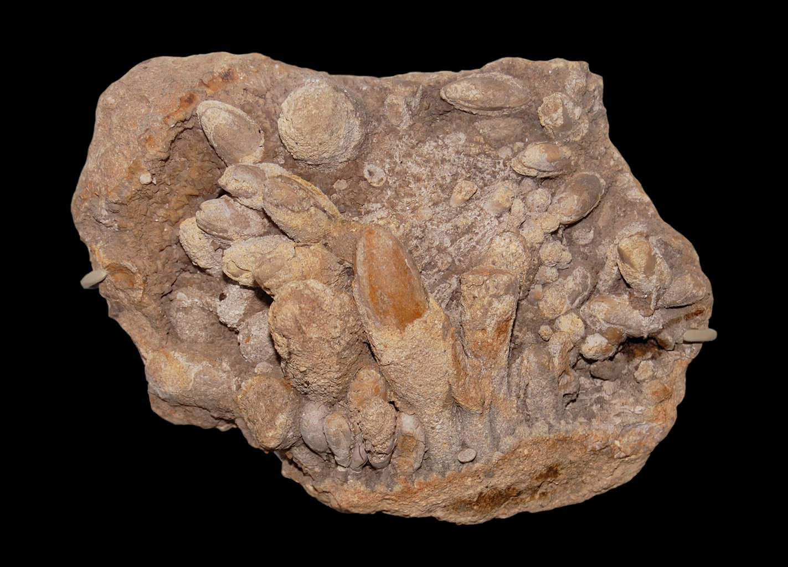
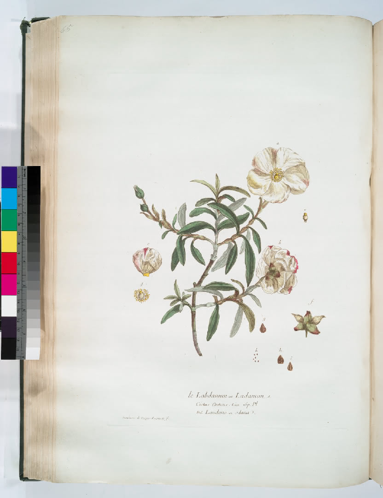
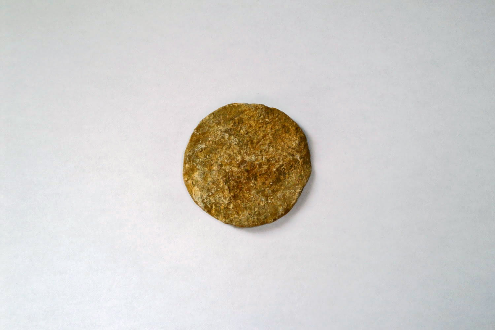
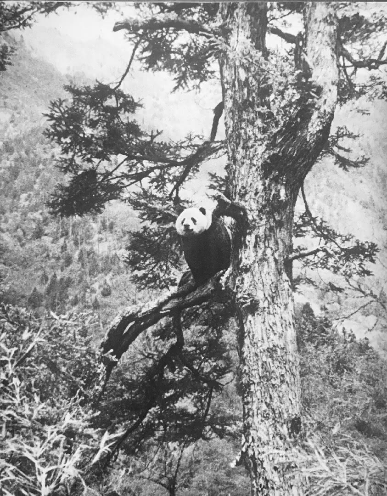
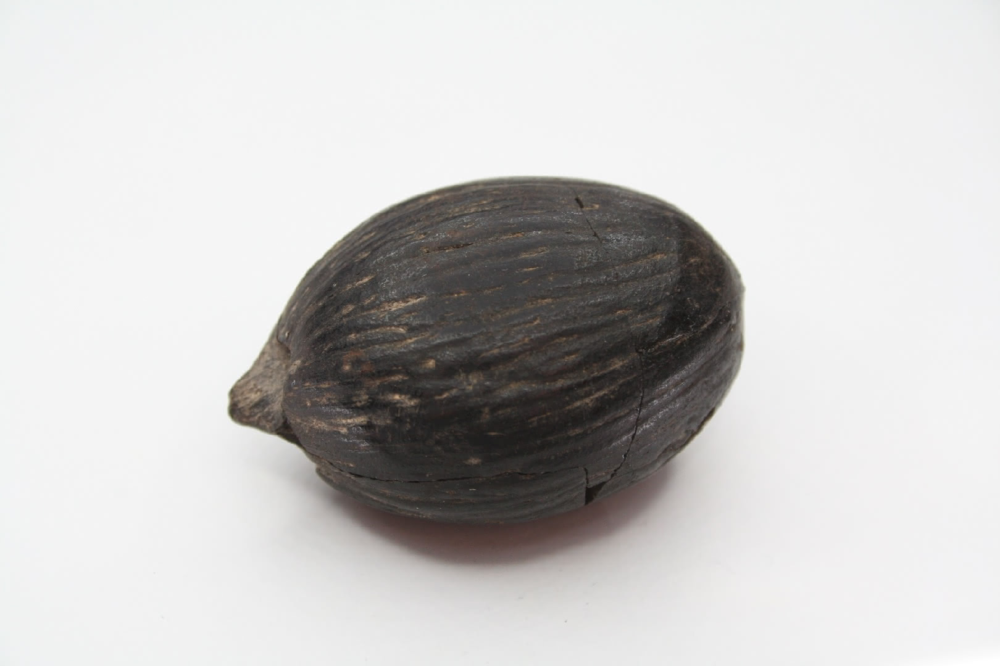
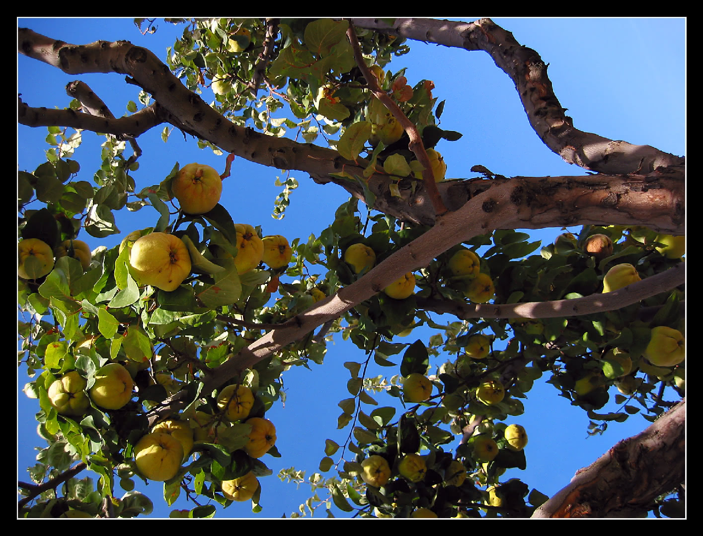

<link rel="stylesheet" href="https://cdn.jsdelivr.net/npm/justifiedGallery@3.8.1/dist/css/justifiedGallery.css" />
<link rel="stylesheet" href="https://cdn.jsdelivr.net/npm/lightgallery@2.7.0/css/lightgallery.css" />
<link rel="stylesheet" href="https://cdn.jsdelivr.net/npm/lightgallery@2.7.0/css/lg-thumbnail.css" />
<link rel="stylesheet" href="https://cdn.jsdelivr.net/npm/lightgallery@2.7.1/css/lg-zoom.css">
<link rel="stylesheet" href="../../style/lg-image.css">

    <a href="jaffa/Commiphora.jpg"
        data-sub-html="

        <h4>Commiphora ⚪没药 ⚫与玫瑰,龙涎香 构成了阿拉伯-伊斯兰世界三大基础精油 ⚫古埃及,非洲之角阿拉伯半岛间的海上贸易 曾有象牙,黄金,猫科动物的皮毛,没药,乳香</h4>
        
.img by <a href='https://www.flickr.com/photos/cifor-icraf/'>CIFOR-ICRAF</a> on <a href='https://www.flickr.com/photos/cifor-icraf/53707347175' target='_blank' rel='nofollow noopener'>flickr</a> / <a href='https://creativecommons.org/licenses/by-nc-nd/2.0/' target='_blank' rel='nofollow noopener'>cc by-nc-nd 2.0</a>

        
">
        
    </a>
    <a href="jaffa/Sepioloidea_lineolata.jpg"
        data-slide-name="Sepioloidea lineolata"
        data-sub-html="

        <h4>Sepioloidea lineolata ⚪条纹鱿 ⚪条纹睡衣乌贼</h4>
        
img by <a href='https://www.flickr.com/photos/pacificklaus/'>Klaus Stiefel</a> on <a href='https://www.flickr.com/photos/pacificklaus/9655269808' target='_blank' rel='nofollow noopener'>flickr</a> / <a href='https://creativecommons.org/licenses/by-nc/2.0/' target='_blank' rel='nofollow noopener'>cc by-nc 2.0</a>

        
">
        
    </a>
    <a href="jaffa/Opiliones.jpg"
        data-slide-name="Opiliones"
        data-sub-html="

        <h4>Opiliones ⚪盲蛛 ⚫其历史可追溯到鱼的时代 早泥盆世普拉亚(Pragian)期的水成岩床萊尼燧石(Rhynie chert)</h4>
        
img by <a href='https://www.flickr.com/photos/vitiman/'>VITIMan</a> on <a href='https://www.flickr.com/photos/vitiman/30653233661' target='_blank' rel='nofollow noopener'>flickr</a> / <a href='https://creativecommons.org/licenses/by-nc-nd/2.0/' target='_blank' rel='nofollow noopener'>cc by-nc-nd 2.0</a>

        
">
        
    </a>
    <a href="jaffa/Citrullus_ecirrhosus.jpg"
        data-slide-name="Citrullus_ecirrhosus"
        data-sub-html="

        <h4>Citrullus ecirrhosus ⚫荒漠始祖西瓜 多年生藤本植物</h4>
        
img by <a href='https://www.flickr.com/photos/jeppestown/'>Jeppestown</a> on <a href='https://www.flickr.com/photos/jeppestown/3050326335' target='_blank' rel='nofollow noopener'>flickr</a> / <a href='https://creativecommons.org/licenses/by-sa/2.0/' target='_blank' rel='nofollow noopener'>cc by-sa 2.0</a>

        
">
        
    </a>
    <a href="jaffa/Artemia_salina.jpg"
        data-slide-name="Artemia_salina"
        data-sub-html="

        <h4>Artemia salina ⚪卤虾 ⚫会经历脱水,休眠阶段</h4>
        
img by <a href='https://www.flickr.com/photos/zpyder/' target='_blank' rel='nofollow noopener'>Artemia salina</a> on <a href='https://www.flickr.com/photos/zpyder/7041755631' target='_blank' rel='nofollow noopener'>flickr</a> / <a href='https://creativecommons.org/licenses/by-nc/2.0/' target='_blank' rel='nofollow noopener'>cc by-nc 2.0</a>

        
">
        
    </a>
    <a href="jaffa/Mimosa_tenuiflora.jpg"
        data-slide-name="Mimosa_tenuiflora"
        data-sub-html="

        <h4>Mimosa tenuiflora ⚪细花含羞草</h4>
        
img by <a href='https://www.flickr.com/photos/cerrados/' target='_blank' rel='nofollow noopener'>João Medeiros</a> on <a href='https://www.flickr.com/photos/cerrados/6945978738' target='_blank' rel='nofollow noopener'>flickr</a> / <a href='https://creativecommons.org/licenses/by/2.0/' target='_blank' rel='nofollow noopener'>cc by 2.0</a>

        
">
        
    </a>
    <a href="jaffa/Lynx.jpg"
        data-slide-name="Lynx"
        data-sub-html="

		<h4>Lynx ⚪猞猁</h4>
		
img by <a href='https://www.flickr.com/photos/blacktigersdream' target='_blank' rel='nofollow noopener'>Cloudtail the Snow Leopard</a> on <a href='https://www.flickr.com/photos/blacktigersdream/15001013298' target='_blank' rel='nofollow noopener'>flickr</a> / <a href='https://creativecommons.org/licenses/by-nc-nd/2.0/' target='_blank' rel='nofollow noopener'>cc by-nc-nd 2.0</a>

        
">
        
    </a>
    <a href="jaffa/Helichrysum_doerfleri.jpg"
        data-slide-name="Helichrysum_doerfleri"
        data-sub-html="

		<h4>Helichrysum doerfleri</h4>
		
img by <a href='https://www.flickr.com/photos/nturland/' target='_blank' rel='noopener' class='ume'>Nicholas Turland</a> on <a href='https://www.flickr.com/photos/nturland/2637365947' target='_blank' rel='noopener' class='ume'>flickr</a> / <a href='https://creativecommons.org/licenses/by-nc-nd/2.0/' target='_blank' rel='noopener' class='ume'>cc by-nc-nd 2.0</a>

        
">
        
    </a>
    <a href="jaffa/Anthus_pratensis.jpg"
        data-slide-name="Anthus_pratensis"
        data-sub-html="

		<h4>Anthus pratensis ⚪草地鹨 ⚫栖息于草场,沼泽,林地等开放地带 也在从事捕食时使用灌木,围篱,电线等高架建筑 ⚫巢位于地面 掩蔽在茂密植被下 卵在11~15天后孵化 雏鸟在10~14天后羽翼丰满 ⚫是有窝寄生习性的某些杜鹃的主要宿主 在卵拟态中 寄生鸟卵模拟了宿主鸟卵的大小和颜色</h4>
		
img by <a href='https://www.flickr.com/photos/ivl_wildlife_photography/' target='_blank' rel='noopener'>Ingeborg van Leeuwen</a> on <a href='https://www.flickr.com/photos/ivl_wildlife_photography/50016616212' target='_blank' rel='noopener'>flickr</a> / <a href='https://creativecommons.org/licenses/by-nc-nd/2.0/' target='_blank' rel='noopener'>cc by-nc-nd 2.0</a>

		
">
		
	</a>
    <a href="jaffa/Euprymna_berryi.jpg"
        data-slide-name="Euprymna_berryi"
        data-sub-html="

		<h4>Euprymna berryi ⚪浆果耳鱿 ⚫身形紧凑而圆形 雄性3cm以下 雌性5cm以下 ⚫分布于沙质或细沉积物的海床 在白天埋沙 利用小夜灯捕食小底栖甲壳类</h4>
		
img by <a href='https://www.flickr.com/photos/silkebaron/' target='_blank' rel='noopener'>Silke Baron</a> on <a href='https://www.flickr.com/photos/silkebaron/4873635819' target='_blank' rel='noopener'>flickr</a> / <a href='https://creativecommons.org/licenses/by/2.0/' target='_blank' rel='noopener'>cc by 2.0</a>

        
">
        
    </a>
    <a href="jaffa/Gulo_gulo.jpg"
        data-slide-name="Gulo_gulo"
        data-sub-html="

		<h4>Gulo gulo ⚪狼獾 ⚫大型鼬科 臀周有淡黄色宽腰带</h4>
		
img by <a href='https://www.flickr.com/photos/karljonsson/' target='_blank' rel='noopener'>jonsson</a> on <a href='https://www.flickr.com/photos/karljonsson/6070776950/' target='_blank' rel='noopener'>flickr</a> / <a href='https://creativecommons.org/licenses/by/2.0/' target='_blank' rel='noopener'>cc by 2.0</a>

        
">
        
    </a>
    <a href="jaffa/Conocephalum_conicum.jpg"
        data-slide-name="Conocephalum_conicum"
        data-sub-html="

		<h4>Conocephalum conicum ⚪蛇苔</h4>
		
img by <a href='https://www.flickr.com/photos/dw_ross/' target='_blank' rel='noopener'>MostlyDross</a> on <a href='https://www.flickr.com/photos/dw_ross/48937971853/' target='_blank' rel='noopener'>flickr</a> / <a href='https://creativecommons.org/licenses/by/2.0/' target='_blank' rel='noopener'>cc by 2.0</a>

        
">
        
    </a>
    <a href="jaffa/Gymnostomum_aeruginosum.jpg"
        data-slide-name="Gymnostomum_aeruginosum"
        data-sub-html="

		<h4>Gymnostomum aeruginosum</h4>
		
img by <a href='https://commons.wikimedia.org/wiki/User:HermannSchachner' target='_blank' rel='noopener'>HermannSchachner</a> on <a href='https://commons.wikimedia.org/wiki/File:Gymnostomum_aeruginosum_(a,_145144-474909)_8390.JPG' target='_blank' rel='noopener'>wikicommon</a> / <a href='https://creativecommons.org/publicdomain/zero/1.0' target='_blank' rel='noopener'>cc 0</a>

        
">
        
    </a>
    <a href="jaffa/Ceterach_officinarum.jpg"
        data-slide-name="Ceterach_officinarum"
        data-sub-html="

		<h4>Ceterach officinarum</h4>
		
img by <a href='https://www.flickr.com/photos/lennyworthington/' target='_blank' rel='noopener'>Len Worthington</a> on <a href='https://www.flickr.com/photos/lennyworthington/6165555817' target='_blank' rel='noopener'>flickr</a> / <a href='https://creativecommons.org/licenses/by-sa/2.0/' target='_blank' rel='noopener'>cc by-sa 2.0</a>

        
">
        
    </a>
    <a href="jaffa/Oxychilus_navarricus.jpg"
        data-slide-name="Oxychilus_navarricus"
        data-sub-html="

		<h4>Oxychilus navarricus ⚪玻璃蜗牛</h4>
		
img by <a href='https://www.flickr.com/photos/runnerwill/' target='_blank' rel='noopener'>Will George</a> on <a href='https://www.flickr.com/photos/runnerwill/16857138496' target='_blank' rel='noopener'>flickr</a> / <a href='https://creativecommons.org/licenses/by-nc/2.0/' target='_blank' rel='noopener'>cc by-nc 2.0</a>

        
">
        
    </a>
    <a href="jaffa/Androniscus_dentiger.jpg"
        data-slide-name="Androniscus_dentiger"
        data-sub-html="

		<h4>Androniscus dentiger ⚪齿潮虫</h4>
		
img by <a href='https://www.flickr.com/photos/sanmartin/' target='_blank' rel='noopener'>Gilles San Martin</a> on <a href='https://www.flickr.com/photos/sanmartin/3596867912/' target='_blank' rel='noopener'>flickr</a> / <a href='https://creativecommons.org/licenses/by-sa/2.0/' target='_blank' rel='noopener'>cc by-sa 2.0</a>

        
">
        
    </a>
    <a href="jaffa/Helianthemum_apenninum.jpg"
        data-slide-name="Helianthemum_apenninum"
        data-sub-html="

		<h4>Helianthemum apenninum ⚪白岩蔷薇 ⚫分布于干燥草地和多岩地 可长至50厘米 花直径约30毫米 叶对生 呈矛状 花期3至7月</h4>
		
img by <a href='https://www.flickr.com/photos/40948266@N04/' target='_blank' rel='noopener'>Björn S...</a> on <a href='https://www.flickr.com/photos/40948266@N04/26877247272/' target='_blank' rel='noopener'>flickr</a> / <a href='https://creativecommons.org/licenses/by-sa/2.0/' target='_blank' rel='noopener'>cc by-sa 2.0</a>

        
">
        
    </a>
    <a href="jaffa/bagworm.jpg"
        data-slide-name="bagworm"
        data-sub-html="

		<h4>bagworm ⚪袋蛾 ⚫该科幼虫会组合丝和环境材料来搭建小型箱房 拖行于岩石,树木,篱笆 其胶囊材质坚硬 可由鸟类吞下后空投 ⚫雌虫始终是幼态的 且不离开舱室 ⚫虫的龄通常依次是卵,孵化,幼虫,蜕皮,茧,蛹,成虫,死亡 ⚫某些物种会生活于某类昆虫的社会中 成为终身的食客和房客</h4>
		
img by <a href='https://www.flickr.com/photos/teejaybee/' target='_blank' rel='noopener'>Troy Bell</a> on <a href='https://www.flickr.com/photos/teejaybee/1026325540/' target='_blank' rel='noopener'>Flickr</a> / <a href='https://creativecommons.org/licenses/by-nc-nd/2.0/' target='_blank' rel='noopener'>cc by-nc-nd 2.0</a>

        
">
        
    </a>
    <a href="jaffa/Leptodirus_hochenwartii.jpg"
        data-slide-name="Leptodirus_hochenwartii"
        data-sub-html="

		<h4>Leptodirus hochenwartii ⚪细颈甲虫 ⚫真穴居物种 丧失昼夜节律 季候节律受降雨模型影响 长足,无翅,无肤色,具无眼征 ⚫称作假膜腹的圆形鞘翅下可储存湿润空气 经较干燥地区时 消耗于呼吸 ⚫饮食包括渗水,蝙蝠粪,鸟粪,尸体等 ⚫卵减产至一枚 大且晚熟 幼虫羽化前绝食</h4>
		
img by <a href='https://www.flickr.com/photos/profundezas/' target='_blank' rel='noopener'>Profundezas</a> on <a href='https://www.flickr.com/photos/profundezas/5275658028' target='_blank' rel='noopener'>flickr</a> / <a href='https://creativecommons.org/licenses/by-nc-nd/2.0/' target='_blank' rel='noopener'>cc by-nc-nd 2.0</a>

        
">
        
    </a>
    <a href="jaffa/Eobania_vermiculata.jpg"
        data-slide-name="Eobania_vermiculata"
        data-sub-html="

		<h4>Eobania vermiculata ⚪棕带陆蜗牛 ⚫壳宽22~32毫米 高14~24毫米 颜色可变 通常壳体具较深的色带或斑点 侧腹有两条棕带 第二条色带到肚脐间发白 背部通常有4到5条螺纹 末端的螺纹斜下到壳的周边 壳唇白色 成年后外翻 且脐孔封闭在螺壳内 ⚫通常栖息在近海的干燥植被中 在湿润雨天或晚上活跃 冬眠或夏眠 ⚫成年蜗牛会掘土 并在壳口建造临时的栅栏(epiphragm) 一种似于螺壳的永久性的解剖特征 由其幔层(斗篷)分泌的干粘液制成 透气,刚性,抗干燥,抗腐蚀 ⚫部分的种类会借此黏在岩表,墙壁,树枝,茎等固体基质上 ⚪该结构可能是出埃及记中提到的香火成分 希腊语的onycha 意思是指甲或爪子 ⚫该属物种在发情期时 会烧制一种钙质飞镖 用于求偶仪式中 以液压力穿透受体的皮肤 ⚫可作为季节性食物 ⚫该相片摄于塞浦路斯(Zypern) 法语名西浦(Chypre) 的法玛古斯塔(Famagusta)</h4>
		
img by <a href='https://www.flickr.com/photos/wiseguy71' target='_blank' rel='noopener'>wiseguy71</a> on <a href='https://www.flickr.com/photos/wiseguy71/5128383104' target='_blank' rel='noopener'>flickr</a> / <a href='https://creativecommons.org/licenses/by-sa/2.0/' target='_blank' rel='noopener'>cc by-sa 2.0</a>

        
">
        
    </a>
    <a href="jaffa/Buxus_sempervirens_'Suffruticosa'.jpg"
        data-slide-name="Buxus_sempervirens_'Suffruticosa'"
        data-sub-html="

		<h4>Buxus sempervirens 'Suffruticosa' ⚪灌木黄杨 ⚫常绿 耐修剪 木材重且坚硬</h4>
		
img by <a href='https://www.flickr.com/photos/13389908@N03/' target='_blank' rel='noopener'>Maggie</a> on <a href='https://www.flickr.com/photos/13389908@N03/2328080036/' target='_blank' rel='noopener'>flickr</a> / <a href='https://creativecommons.org/licenses/by-nc/2.0/' target='_blank' rel='noopener'>cc by-nc 2.0</a>

        
">
        
    </a>
    <a href="jaffa/Cinnamomum_camphora.jpg"
        data-slide-name="Cinnamomum_camphora"
        data-sub-html="

		<h4>Cinnamomum camphora ⚪樟 ⚪樟脑 ⚫一种半透明,蜡状,易燃的固体 具穿透性气味 闭口闪点66摄氏度 ⚫用于木乃伊化的防腐抗菌过程 是古代阿拉伯常见的香水成分 也作为中世纪糖果和菜肴原料 ⚫作局部用药时伴随轻微镇痛 用力涂抹会产生温暖感 轻柔涂抹时产生清凉感 ⚪闪点 ⚫是施加点火源时 维持蒸汽浓度 引起闪燃的温度下限 ⚫是一组描述性特征 可以标识燃料的火灾隐患 用于区分易燃燃料和可燃燃料 ⚫桉树脑是商用漱口水的一种成分 ⚫在某报告中 鱼以浅,浊区别气味 蜂蜜以轻,重区别光亮和黑暗</h4>
		
img by <a href='https://www.flickr.com/photos/siddarthmachado/' target='_blank' rel='noopener'>Siddarth Machado</a> on <a href='https://www.flickr.com/photos/siddarthmachado/47953620208/' target='_blank' rel='noopener'>flickr</a> / <a href='https://creativecommons.org/licenses/by-nc/2.0/' target='_blank' rel='noopener'>cc by-nc 2.0</a>

        
">
        
    </a>
    <a href="jaffa/Elysia_ornata.jpg"
        data-slide-name="Elysia_ornata"
        data-sub-html="

		<h4>Elysia ornata ⚪丽叶海天牛 ⚫热带物种 可以长到5厘米 呈半透明黄绿色 带白黑斑点 具有宽阔的伪足或伪翼 ⚫一些海天牛以季节性食物为生 由于无法穿透这种绿藻钙化时的细胞壁 它们畜牧未消化的叶绿体 直到斋戒过去 ⚪细胞这个词最早用来指软木的微小蜂房状空腔 ⚫在赤道热带的森林地区 白天只有少量阳光穿过浓密树荫 晨昏的露水和浓雾是重要水源</h4>
		
img by <a href='https://www.flickr.com/photos/pacificklaus/' target='_blank' rel='noopener'>Klaus Stiefel</a> on <a href='https://www.flickr.com/photos/pacificklaus/6336091966/' target='_blank' rel='noopener'>flickr</a> / <a href='https://creativecommons.org/licenses/by-nc/2.0/' target='_blank' rel='noopener'>cc by-nc 2.0</a>

        
">
        
    </a>
    <a href="jaffa/Onchidella_celtica.jpg"
        data-slide-name="Onchidella_celtica"
        data-sub-html="

		<h4>Onchidella celtica ⚪凯尔特蛞蝓 ⚫一种有肺的海生鼻涕虫 可以长到12mm 呈橄榄色至黑色 ⚫生活在多岩的潮间带 退潮时暴露在外 可能在舔食岩表 涨潮时退回到岩缝里</h4>
		
img by Auguste Le Roux on <a href='https://commons.wikimedia.org/wiki/File:Onchidella_celtica_0377.jpg' target='_blank' rel='noopener'>wikicommons</a> / <a href='https://creativecommons.org/licenses/by-sa/3.0/' target='_blank' rel='noopener'>cc by-sa 3.0</a>

        
">
        
    </a>
    <a href="jaffa/Lathyrus_aphaca.jpg"
        data-slide-name="Lathyrus_aphaca"
        data-sub-html="

		<h4>Lathyrus aphaca ⚪阿法卡香豌豆 ⚫一年生草本 适合干燥,排水良好的栖地</h4>
		
img by <a href='https://commons.wikimedia.org/wiki/User:Zcebeci' target='_blank' rel='noopener'>Zeynel Cebeci</a> on <a href='https://commons.wikimedia.org/wiki/File:Lathyrus_aphaca_-_Sar%C4%B1_bur%C3%A7ak_01.jpg' target='_blank' rel='noopener'>wikicommons</a> / <a href='https://creativecommons.org/licenses/by-sa/4.0/' target='_blank' rel='noopener'>cc by-sa 4.0</a>

        
">
        
    </a>
    <a href="jaffa/Microvoluta_amphissa.jpg"
        data-slide-name="Microvoluta_amphissa."
        data-sub-html="

		<h4>Microvoluta amphissa ⚪安菲莎小海螺 ⚫一种很小的海蜗牛</h4>
		
img by Manuel CABALLER on <a href='https://science.mnhn.fr/institution/mnhn/collection/im/item/2000-30155' target='_blank' rel='noopener'>MNHN</a> / <a href='https://creativecommons.org/licenses/by/4.0/' target='_blank' rel='noopener'>cc by 4.0</a>

        
">
        
    </a>
    <a href="jaffa/Diogenes_pugilator.jpg"
        data-slide-name="Diogenes_pugilator"
        data-sub-html="

		<h4>Diogenes pugilator ⚪第欧根尼小寄居蟹 ⚫从浅层潮下的软基质到深达1800m都有分布 最常见于浅水 ⚫倾向于占用网状狗螺(Tritia reticulata)的壳</h4>
		
img by befe on <a href='https://commons.wikimedia.org/wiki/File:CRU_pag.jpg' target='_blank' rel='noopener'>wikicommons</a> / <a href='https://creativecommons.org/licenses/by-sa/2.0/' target='_blank' rel='noopener'>cc by-sa 2.0</a>

        
">
        
    </a>
    <a href="jaffa/Miletus_mallus.jpg"
        data-slide-name="Miletus_mallus"
        data-sub-html="

		<h4>Miletus mallus ⚪米利都锤纹蝶 ⚪Lycaenidae(灰蝶科) ⚪科名是吕卡恩(Lycaena)的同名 也被普遍地称为蓝色者 但有指正应称铜色者 ⚫该科成虫通常小于5厘米 其中约75%的物种与蚂蚁关联 这其中的部分的毛虫是食虫的 专门捕食蚁丘内的雏蚁 且是蚂蚁饲养的蚜虫的天敌 ⚪myrmecophily(嗜麦芽性) ⚪一个跟蚂蚁相关的术语 字面意义就是蚂蚁喜爱 ⚫大多数亲蚁派与宿主蚁群的关系是兼职的 例如在蚁巢中消耗废物 如死蚂蚁,死幼虫,巢中真菌 多个科的植物以筑巢地和食物资源 交换种子传播 或者极具攻击性的蚁种的专职保护 以免受素食 并经常附带卫生服务 包括清洁叶片表面,修剪附生植物,梳理临近植物嫩芽 ⚫蚂蚁也将半翅目幼虫带入蚁巢 同雏蚁一起抚养 包括鳞龟(coccidae),粉虱(pseudococcidae),树蚤(membracidae)等 它们也被携带到不同的植物或不同部位 以确保新鲜的食物来源 和对牛群的充分保护 据观察蚁后在分散航程中会运输蚜虫 以建立一个新的殖民地</h4>
		
img by <a href='https://www.flickr.com/photos/chaz_pics/' target='_blank' rel='noopener'>Charlie Jackson</a> on <a href='https://www.flickr.com/photos/chaz_pics/39583407064/' target='_blank' rel='noopener'>flickr</a> / <a href='https://creativecommons.org/licenses/by/2.0/' target='_blank' rel='noopener'>cc by 2.0</a>

        
">
        
    </a>
    <a href="jaffa/parsnip.jpg"
        data-slide-name="parsnip"
        data-sub-html="

		<h4>parsnip ⚪野萝卜 ⚫二年生根类蔬菜 具奶油色果皮和果肉 煮熟或生吃 霜冻后更甜 因为土壤低温会导致根部存储的一些淀粉转化为糖 ⚫曾用作甜味剂 在玉米普及前 主要用来喂猪 在现代意大利 是制作帕尔玛火腿的猪的专门饲料 ⚫它与胡萝卜科的许多近亲共享一种光毒化合物呋喃香豆素(furanocoumarins) 能引起一种植物性光线皮肤炎 当皮肤不慎接触到芽叶的汁液又暴露于日光下时 会出现发红,灼痛,水泡等症状 创伤区域会持续敏感,变色长达两年</h4>
		
img by <a href='https://www.flickr.com/photos/morris278/' target='_blank' rel='noopener'>John Morris</a> on <a href='https://www.flickr.com/photos/morris278/25259574002/' target='_blank' rel='noopener'>flickr</a> / <a href='https://creativecommons.org/licenses/by-nc-nd/2.0/' target='_blank' rel='noopener'>cc by-nc-nd 2.0</a>

        
">
        
    </a>
    <a href="jaffa/Lithophaga.jpg"
        data-slide-name="Lithophaga"
        data-sub-html="

		<h4>Lithophaga ⚪石蜊 ⚫中型贻贝 壳长而窄 背侧和腹侧或多或少平行 ⚪lithos是希腊语石头之意 因其利用腺体分泌物钻入岩石或珊瑚岩 所以称lithophaga(食石者)  ⚫一些因缓动(bradyseism)沉水的大理石柱因此环布钻孔 这些孔状的牙印有一个专有词 开腹蛤石(Gastrochaenolites) ⚪ichnofossil(生痕化石) ⚪ichno来自希腊语ikhnos(痕迹 踪迹) ⚫是生物活动的记录 而不是生物本身的残骸 例如洞穴,钻孔(生物侵蚀),尿石(排尿引起土壤侵蚀),脚印 广义上还包括僵化粪便,化学标记物等 ⚪痕相(ichnofacies)是生痕化石的集合 ⚫可指示造型生物所居住的条件 包括水深,盐度,浊度,能量等 例如通常在湍流的光合带浅水区 浮游物相对丰富 垂直洞穴也更为安全 而在低能量环境的深水区 食物均匀地沉降 觅食者就需要水平打洞</h4>
		
img by <a href='https://www.flickr.com/photos/paleo_bear/' target='_blank' rel='noopener'>the paleobear</a> on <a href='https://www.flickr.com/photos/paleo_bear/36692362310' target='_blank' rel='noopener'>flickr</a> / <a href='https://creativecommons.org/licenses/by/2.0/' target='_blank' rel='noopener'>cc by 2.0</a>

        
">
        
    </a>
    <a href="jaffa/Nicolas_Francois_Regnault_Le_Labdanum,_ou_Ladanum..jpg"
        data-slide-name="Nicolas_Francois_Regnault_Le_Labdanum,_ou_Ladanum."
        data-sub-html="

		<h4>Cistus ladanifer ⚪劳丹姆岩蔷薇 ⚫浓密直立灌木 高1~2.5米 略宽 披针形常绿长3~10厘米 宽1~2厘米 正面深绿 背面浅绿或灰色 花直径5~8厘米 有5片白色花瓣 基部通常有红色到栗色的斑点 夏季炎热时整株植物当年新芽受树脂覆盖 散发芬芳 适于干旱花园或海滨花园 ⚫叶表的一层类树脂 称为劳丹姆(labdanum) 主要从该种和克里特岩蔷薇(Cistus creticus)获得 远古时通过梳理山羊和绵阳的胡须和大腿来收集 呈棕色 气味浓郁,复杂,牢固 被形容为琥珀气味,动物气味,甜味,水果香,木质香,龙涎香,干麝香,皮革味 据说是出埃及记30:34-36中的圣香 医学上用于感冒,咳嗽,月经失调,风湿等 在香水和苦艾酒中使用 可作固色剂 ⚪属名来自古希腊植物名 该属对鹿的啃食有一定抵抗力 ladanifer的字面意思就是 劳丹姆的承载物</h4>
		
Le Labdanum, ou Ladanum. (1774) - Nicolas Francois Regnault, 
img on <a href='https://digitalcollections.nypl.org/items/510d47dc-7dbe-a3d9-e040-e00a18064a99' target='_blank' rel='noopener'>NYPL</a> / <a href='https://creativecommons.org/publicdomain/mark/1.0/' target='_blank' rel='noopener'>pdm</a>

        
">
        
    </a>
    <a href="jaffa/Dwarf_crocodile.jpg"
        data-slide-name="Dwarf_crocodile"
        data-sub-html="

		<h4>Dwarf crocodile ⚪矮鳄鱼 ⚫部分体长不超过1.2米 幼鳄的头有黄色斑纹 身和尾有浅棕色条纹 成年鳄的背面和侧面呈深色 腹面淡黄色带黑色斑点 生活在山洞中具橙色斑块 是受蝙蝠粪腐蚀 ⚫生活在低地到中海拔 远离大河的森林到荫蔽的溪流,小河,沼泽,水池,潮间林 ⚫胆小 夜行 白天整日藏在池塘,洞穴,树根 很少晒太阳 雨天时栖所被淹没 变得活跃起来 觅食范围在雨后扩大 以小动物为食 包括螃蟹,青蛙,腹足类,昆虫,蜥蜴,水禽等 季节食谱是湿季的鱼和干季的甲壳类 ⚫发情期以外的大部份时间独处 用腐烂的植物和泥巴筑巢 每次生10至17只蛋</h4>
		
img by <a href='https://commons.wikimedia.org/wiki/User:Rufous-crowned_Sparrow' target='_blank' rel='noopener'>Rufous-crowned Sparrow</a> on <a href='https://commons.wikimedia.org/wiki/File:Dwarf_Crocodile_NC_Zoo.JPG' target='_blank' rel='noopener'>wikicommons</a> / <a href='https://creativecommons.org/licenses/by/3.0/' target='_blank' rel='noopener'>cc by 3.0</a>

        
">
        
    </a>
        <a href="jaffa/Threskiornis_aethiopicus.jpg"
            data-slide-name="Threskiornis_aethiopicus"
        data-sub-html="

        <h4>Threskiornis aethiopicus ⚪圣鹮 ⚫通常在湿地或滩涂的树或地上筑巢 在浅水区或草场涉足 参观耕地和垃圾场 食虫,小型两栖,爬行,软体,哺乳动物,腐肉,或种子 ⚫解剖文述中 在其喙上发现了孔洞 据说曾用于治疗河马 是灌肠剂的由来 ⚫制成的其中一种木乃伊 包裹了交织和打褶的棕色或褐色亚麻布 放入陶棺</h4>
        
img by <a href='https://www.flickr.com/photos/101561334@N08/' target='_blank' rel='nofollow noopener'>Gary Todd</a> on <a href='https://www.flickr.com/photos/101561334@N08/10435597985' target='_blank' rel='nofollow noopener'>flickr</a> / <a href='https://creativecommons.org/publicdomain/zero/1.0/' target='_blank' rel='nofollow noopener'>cc 0</a>

        
">
        
    </a>
    <a href="jaffa/Diospyros_lotus.jpg"
        data-slide-name="Diospyros_lotus"
        data-sub-html="

		<h4>Diospyros lotus ⚪英文俗名date-plum(枣李)可能来自波斯语 就是字面意思 味道像枣和李 ⚫古老的栽培柿属 果实小而圆 平均直径1~2厘米 ⚪也称小紫柿 经历霜冻后呈淡紫色 变得同制成干果一般甜</h4>
		
img by <a href='https://ja.wikipedia.org/wiki/user:%CE%A3%EF%BC%96%EF%BC%94' target='_blank' rel='noopener'>Σ64</a> on <a href='https://zh.wikipedia.org/wiki/File:Diospyros_lotus_01.jpg' target='_blank' rel='noopener'>wikicommons</a> / <a href='https://creativecommons.org/licenses/by-sa/3.0/' target='_blank' rel='noopener'>cc by-sa 3.0</a>

        
">
        
    </a>
    <a href="jaffa/Mesochordaeus_erythrocephalus.jpg"
        data-slide-name="Mesochordaeus_erythrocephalus"
        data-sub-html="

		<h4>Mesochordaeus erythrocephalus ⚪红脑囊虫 ⚫躯干长7毫米 分叉的尾巴长50毫米 新月形的外粘液室宽约30厘米 消化系统含鲜红色素 ⚪所属尾海鞘纲(Appendicularia) 异名幼态纲(Larvacea) 在整个生命过程中都保留着幼虫形态 ⚫分布于中深海 在室内周期地拍打尾巴 产生水流 聚集食物 房屋在被废弃后沉降到深海</h4>
		
on <a href='https://www.mbari.org/midwater_expedition_2018/?platform=hootsuite' target='_blank' rel='noopener'>mbari</a> / <a href='https://www.mbari.org/monterey-bay-aquarium-research-institute/terms-of-use/' target='_blank' rel='noopener'>terms of use</a>

        
">
        
    </a>
    <a href="jaffa/Saxifraga_aizoides.jpg"
        data-slide-name="Saxifraga_aizoides"
        data-sub-html="

		<h4>Saxifraga aizoides ⚪常绿岩箔 ⚪种名源于拉丁语saxum(岩石)和frangere(断裂) 希腊词aizoides意为永生 指常绿的 ⚫多年生小型草本 高5~20厘米 花通常黄色 有时带红点 或为桦色,红紫色 ⚫通常被认为用于治疗尿路结石</h4>
		
img by <a href='https://www.flickr.com/photos/40948266@N04/' target='_blank' rel='noopener'>Björn S...</a> on <a href='https://www.flickr.com/photos/40948266@N04/44305471131/' target='_blank' rel='noopener'>flickr</a> / <a href='https://creativecommons.org/licenses/by-sa/2.0/' target='_blank' rel='noopener'>cc by-sa 2.0</a>

        
">
        
    </a>
    <a href="jaffa/Myrrha_octodecimguttata.jpg"
        data-slide-name="Myrrha_octodecimguttata"
        data-sub-html="

		<h4>Myrrha octodecimguttata ⚪十八斑瓢虫 ⚪瓢虫名coccinellids源于拉丁语coccineus 意为猩红 ⚫体长4~5mm 多生活在针叶林的冠层 成虫聚集在剥离的树皮和老松树底部树干的缝隙中越冬 ⚫该科的某些种产卵时会依据食物充足程度产下不育卵 作为幼虫的后备食物 ⚪属名myrrha(没药) 源于古希腊语murra 根源于闪语族 阿拉伯语的murr,希伯来语的mor,阿拉姆语的mura都表示苦</h4>
		
img by <a href='https://www.flickr.com/photos/dhobern/' target='_blank' rel='noopener'>Donald Hobern</a> on <a href='https://www.flickr.com/photos/dhobern/8719221737/' target='_blank' rel='noopener'>flickr</a> / <a href='https://creativecommons.org/licenses/by/2.0/' target='_blank' rel='noopener'>cc by 2.0</a>

        
">
        
    </a>
    <a href="jaffa/Hyoscyamus_niger.jpg"
        data-slide-name="Hyoscyamus_niger."
        data-sub-html="

		<h4>Hyoscyamus niger ⚪天仙子 ⚪外消旋体左天仙子碱(hyoscine)也称scopolamine 名字分别来自天仙子属(Hyoscyamus) 和以斯科波利命名的茄科斯科波利亚属(Scopolia) 俗名henbane来源不明 hen可能指死亡 可能与表示疯植物的印欧词干bhelena以及表示幻觉,幻象,魔力,奇迹等的古德语元素bil相关 ⚫钱币的一面印着卡吕冬(Kalydon)的野猪的大都会安菲莎(Amphissa) 所属的德尔菲辖区内 阿波罗的皮提亚(Pythia)服用白花天仙子 或者吸食夹竹桃烟来制作神谕 这些坐在三角凳上的女祭司们也可能是处女妆扮的老妇 ⚫在哥林多(Corinth) 祭司可能也是庙妓 后者在腓尼基城邦阿法卡(Aphaca)延续到了古典时代晚期 博学晚宴(Deipnosophistae)中记载 陶器街上的妓女画着铅白,莓黑 旧约伪经巴录书的耶利米书提到 妇女戴着细绳环 坐在路中 ⚫约翰·杰拉德在草本(Herball)记载 内服它的叶,种,果汁会引起宿醉般的长时间的不安宁的睡眠 对于病人这是致命的 以天仙子煎汤洗脚 再闻到它的花香而催人入眠 ⚫一份宗教法庭的审讯文件记载 女巫承认曾在一对恋人间撒满天仙子种子 她说出公式 在这里播下野生种 魔鬼怂恿彼此憎恨和回避 直至将种子分开</h4>
		
img by <a href='https://commons.wikimedia.org/wiki/User:Sten' target='_blank' rel='noopener'>Sten Porse</a> on <a href='https://commons.wikimedia.org/wiki/File:Hyoscyamus-niger-habitat.JPG' target='_blank' rel='noopener'>wikicommons</a> / <a href='https://creativecommons.org/licenses/by-sa/3.0/' target='_blank' rel='noopener'>cc by-sa 3.0</a>

        
">
        
    </a>
    <a href="jaffa/Lycium_barbarum.jpg"
        data-slide-name="Lycium_barbarum"
        data-sub-html="

		<h4>Lycium barbarum ⚪外地枸杞 ⚪属名Lycium来自希腊语lykion 指生长在吕西亚(Lycia)的 后者位于可以捡到火山玻屑的安那托利亚(Anatolia)半岛南岸 曾托管可能是多利安人(Dorian)的词根 也是其故乡的离岛多里斯(Doris) ⚪罗德岛(Rhodes)也曾是多利安人的飞地 名字来自古希腊语rhodon 表示玫瑰 也可能来自腓尼基语的erod 表示蛇 因为该岛在古代有许多蛇 曾和雅典并为最大的书籍市场 ⚫岛上的水疗胜地用矿物质泉,海水等作药浴 ⚫岛上的城市规划可能有着分明的层次 如古城卡米罗斯(Kamiros) 山顶是雅典式卫城或上城 居民街区位于平原 在更低的露台上 通常有神殿,喷泉广场,集市,用于祭祀等的庭院 ⚪古城罗达(rhoda) 名字来自一种粉色木槿 ⚪Hibiscus(木槿) ⚫常在芳香疗法中使用 ⚪属名源自埃神西比斯 原本用于现锦葵属(Althaea) 后者在希腊语中可表示治愈 ⚫佩达尼乌斯·迪奥斯科里德斯在药物志(De Materia Medica)中以此命名了沼泽锦葵 古埃及医师使用后者的根块和蜂蜜制作棉花糖或喉糖 来治疗喉痛</h4>
		
img by <a href='https://commons.wikimedia.org/wiki/User:AnRo0002' target='_blank' rel='noopener'>AnRo0002</a> on <a href='https://commons.wikimedia.org/wiki/File:20140827Lycium_barbarum2.jpg' target='_blank' rel='noopener'>wikicommons</a> / <a href='https://creativecommons.org/publicdomain/zero/1.0/' target='_blank' rel='noopener'>cc 0</a>

        
">
        
    </a>
    <a href="jaffa/Apocynum_venetum.jpg"
        data-slide-name="Apocynum_venetum"
        data-sub-html="

		<h4>Apocynum venetum ⚪剑叶狗麻 ⚪属名来自古希腊语apo和kuon 意思是用作毒狗的 ⚫韧皮可提取纤维 后者兼具蝉丝的光泽度,苎麻的光滑度,羊绒的可塑性,棉花的柔软度 可作蚊帐,鱼线,火弓等 ⚫叶或整株在夏季采集 可制凉茶 其药效来自西玛琳(cymarine) 后者属卡烯内酯(cardenolide) 一种心脏毒素 可减缓脉搏 作强心剂抗心律失常 也是镇静剂和温和的催眠药</h4>
		
img by <a href='https://commons.wikimedia.org/wiki/User:Gidip' target='_blank' rel='noopener'>Gideon Pisanty(Gidip)</a> on <a href='https://commons.wikimedia.org/wiki/File:Apocynum_venetum_1.jpg' target='_blank' rel='noopener'>wikicommons</a> / <a href='https://creativecommons.org/licenses/by/3.0/' target='_blank' rel='noopener'>cc by 3.0</a>

        
">
        
    </a>
    <a href="jaffa/Urtica_cannabina.jpg"
        data-slide-name="Urtica_cannabina"
        data-sub-html="

		<h4>Urtica cannabina ⚪麻叶荨麻 ⚫多年生草本 干制或沸煮可除去毛刺 ⚫幼叶在收割时需戴上厚手套 在砂锅菜中可代菠菜 ⚫叶茎的汤可提取长久的绿色染料 根部加入明矾沸煮后可提取黄色染料 ⚫一些种的荨麻叶可磨粉制鼻烟止鼻血 其浸液,煎茶可作止屑剂,生发剂</h4>
		
img by <a href='https://www.flickr.com/photos/botalex/' target='_blank' rel='noopener'>Dr. Alexey Yakovlev</a> on <a href='https://www.flickr.com/photos/botalex/33002489460' target='_blank' rel='noopener'>flickr</a> / <a href='https://creativecommons.org/licenses/by-sa/2.0/' target='_blank' rel='noopener'>cc by-sa 2.0</a>

        
">
        
    </a>
    <a href="jaffa/Utricularia_minor.jpg"
        data-slide-name="Utricularia_minor"
        data-sub-html="

		<h4>Utricularia minor ⚪小狸藻 ⚫小型食虫植物 贴生或水生 分布于池塘,沼泽</h4>
		
img on <a href='http://tecen.si/utricularia-minor/' target='_blank' rel='noopener'>tecen.si</a> / <a href='http://creativecommons.org/licenses/by/2.5/' target='_blank' rel='noopener'>cc by 2.5</a>

        
">
        
    </a>
    <a href="jaffa/Arachnothera_flavigaster.jpg"
        data-slide-name="Arachnothera_flavigaster"
        data-sub-html="

		<h4>Arachnothera flavigaster ⚪黄腹捕蛛雀 ⚪种名来自拉丁词flavus和古希腊词gaster 意为黄色和腹部 ⚫属花蜜鸟科 科内的许多种没有隐蔽期羽 会使用大量蛛网将钱袋状的巢悬挂于细树枝 ⚪crypsis(隐蔽) ⚪来自希腊语kryptos ⚫可以指视觉,嗅觉,听觉上的 使其融入环境或伪装等 ⚫特殊的隐蔽色还包括透明,银色,夜行,地下,潜沙等 ⚫常年露宿的阿伯特·汉德森·泰耶在动物界的隐蔽着色(Concealing-Coloration in the Animal Kingdom)写到 许多动物上身色深而下身色浅 以此来平衡自阴影 后者在计算机图形中指照明下的对象对自身和环境的投影 ⚫被提及的还有破裂着色 段落大意是 轮廓等比例地分解 明暗部分意义不明 在这种相分离和相反的模型下 可视细节和形状界线在减少 直至使物体隐蔽 ⚫与之类似的是干扰记号 通常是些斑点 在远距时免于引起注意 在近距时分散注意力 ⚪phenotypes(表征) ⚫鸟巢,海狸坝,石蛾幼虫箱等建筑物被视为扩展表征 ⚫表型是表征的集合 综合征通常包括了一些行为表征 ⚫拖延征源于拉丁语 pro(未来 向前)和crastinus(明天的) 可以识别为一种警戒 触发时心脏收缩 眼动频率加快 视觉信息采样虚化 部分反射信号受遏制 进而认知受影响 ⚫在建筑的想象:玻璃与钢铁的辩证法(The Architectural Imagination: The Dialectics of Glass and Steel)的阐述中 彼得·贝伦斯将戈特弗里德·森佩尔建筑的四要素演绎成 火炉(陶艺),基座(石工),构架(木工),壳(织艺)</h4>
		
img by <a href='https://www.flickr.com/photos/lipkee/' target='_blank' rel='noopener'>Lip Kee</a> on <a href='https://www.flickr.com/photos/64565252@N00/233958035/' target='_blank' rel='noopener'>flickr</a> / <a href='https://creativecommons.org/licenses/by-sa/2.0/' target='_blank' rel='noopener'>cc by-sa 2.0</a>

        
">
        
    </a>
    <a href="jaffa/Gentiana_sedifolia.jpg"
        data-slide-name="Gentiana_sedifolia"
        data-sub-html="

		<h4>Gentiana sedifolia ⚪景天叶龙胆 ⚪种名来自sedum(景天)和folium(叶形) ⚫小药草 高4厘米 狭叶对生 叶最长7毫米 漏斗形花 径直10毫米 淡蓝或紫色 喉部白或淡黄 点缀紫色 在夜晚或冷阴天闭合 ⚫见于高海拔草原</h4>
		
img by <a href='https://www.flickr.com/photos/andrewneild/' target='_blank' rel='noopener'>Andrew Neild</a> on <a href='https://www.flickr.com/photos/andrewneild/13059439025/' target='_blank' rel='noopener'>flickr</a> / <a href='https://creativecommons.org/licenses/by-nc-nd/2.0/' target='_blank' rel='noopener'>cc by-nc-nd 2.0</a>

        
">
        
    </a>
    <a href="jaffa/Helichrysum_italicum.jpg"
        data-slide-name="Helichrysum_italicum"
        data-sub-html="

		<h4> Helichrysum italicum ⚪意大利蜡菊 ⚫叶子有咖喱的气味 但因稍苦和树脂味并未使用 ⚫和鱼或蔬菜一起炖 但在食用前除去 ⚪马耳他语中称其咖喱植物 ⚪Malta(马耳他) ⚪来自于闪语màlat 意指避难所或港口 ⚫当犬种马耳他长期避光 鼻子会褪成粉红或浅棕色 这通常被称为冬天的鼻子 ⚪著有自然史(Naturalis Historia)的盖乌斯·普林尼·塞孔杜斯暗示狗的名字来自亚得里亚海的梅利塔(Méléda)岛 著有地理志的斯特拉波在卡内斯梅利提(Canes Melitei)中称其来自西西里岛梅利塔(Melita)小镇 ⚫普林尼曾描述过地火熄灭后就地建成的某个葡萄园 称其中的一些坑是physas(螺) 当时的葡萄园可能属教会产业 在16世纪后逐渐变更成贵族私营 而葡萄酒可以蒸馏成烧酒(brandewijn) ⚫一世纪的某罗马诗人描述过他朋友的一条名叫以撒的马耳他犬 ⚫发现了矮河马,矮大象等岛屿动物的多萝西娅·米罗拉·爱丽丝·贝特曾考察马耳他岛 每日电讯报(The Daily Telegraph)描述她 她在步行或骡背上度日 穿过贫瘠和土匪出没的地区 在跳蚤缠身的小屋和棚子睡觉 她在汹涌中跋涉 到达孤立的悬崖洞窟 在那徘徊 浑身泥巴和黏土 收集袋,蚊帐,昆虫箱,锤子,再后来的炸药 从未离身 ⚫自然历史杂志(Magazine of Natural History)作为科学文献摘录和发表了玛丽·安林的寄信</h4>
		
img by <a href='https://commons.wikimedia.org/wiki/User:Lamiot' target='_blank' rel='noopener'>Lamiot</a> on <a href='https://commons.wikimedia.org/wiki/File:Helichrysum_italicum%C3%8Eled%27Elbe.jpg' target='_blank' rel='noopener'>wikicommons</a> / <a href='https://creativecommons.org/licenses/by-sa/3.0/' target='_blank' rel='noopener'>cc by-sa 3.0</a>

        
">
        
    </a>
    <a href="jaffa/Sedum_caeruleum.jpg"
        data-slide-name="Sedum_caeruleum"
        data-sub-html="

		<h4>Sedum caeruleum ⚪蓝花景天 ⚫淡蓝色花朵 ⚫低矮而密地分布在多岩的海岸地带</h4>
		
img by <a href='https://www.flickr.com/photos/pauljill/' target='_blank' rel='noopener'>Paul Asman and Jill Lenoble</a> on <a href='https://www.flickr.com/photos/39136124@N00/48099271091' target='_blank' rel='noopener'>flickr</a> / <a href='https://creativecommons.org/licenses/by/2.0/' target='_blank' rel='noopener'>cc by 2.0</a>

        
">
        
    </a>
    <a href="jaffa/gastroliths.jpg"
        data-slide-name="gastroliths"
        data-sub-html="

		<h4>gastroliths ⚪胃石 ⚪来自希腊语gaster和lithos 意为胃和石头 ⚫表面类似磨损的动物齿面 在消化系统中协助食物碾磨 多数在动物死亡时掉落 ⚫一些蛙会摄取淤泥和砾石来调节浮力</h4>
		
img by <a href='https://www.flickr.com/photos/craigpemberton/' target='_blank' rel='noopener'>Craig Pemberton</a> on <a href='https://www.flickr.com/photos/craigpemberton/3791625872/' target='_blank' rel='noopener'>flickr</a> / <a href='https://creativecommons.org/licenses/by-sa/3.0/' target='_blank' rel='noopener'>cc by-sa 3.0</a> or <a href='https://en.wikipedia.org/wiki/en:GNU_Free_Documentation_License' target='_blank' rel='noopener'>gfdl</a>

        
">
        
    </a>
    <a href="jaffa/Dyscophus_antongilii.jpg"
        data-slide-name="Dyscophus_antongilii"
        data-sub-html="

		<h4>Dyscophus antongilii ⚪安东吉尔番茄蛙 ⚪种名来自马达加斯加东北部的安东吉尔港 ⚫两栖类的宽嘴能吞噬体型很大的猎物 眼睑最早可能是在海洋环境中避免渗透 无壳的卵产在水里避免脱水</h4>
		
img by <a href='https://pixabay.com/users/katja-8442/' target='_blank' rel='noopener'>katja</a> on <a href='https://pixabay.com/photos/tomato-frog-frog-frog-through-101271/' target='_blank' rel='noopener'>pixabay</a> / <a href='https://pixabay.com/service/license-summary/' target='_blank' rel='noopener'>pixabay license</a>

        
">
        
    </a>
    <a href="jaffa/Siberian_weasel.jpg"
        data-slide-name="Siberian_weasel"
        data-sub-html="

		<h4>Siberian weasel ⚪黄鼬 ⚫冬毛十分浓密,柔软,蓬松 ⚫体色单调 侧腹或下腹颜色较浅 主要是红赭色或麦秆红 有时有橙色或桃红 脸上有深咖啡色面膜 口吻更深 嘴唇和下巴呈白色或略微赭色 ⚫在倒地的原木,空树桩,柴木堆,裸露树根筑巢 ⚫成年鼬有一个固定洞穴 最多五个临时避难所 之间相距几公里 洞穴中部或尾部有巢室 用鸟羽,鼠毛铺地 ⚫宁可捕食中型啮齿类 也很少吃爬行类,无脊椎类,植物 ⚫被困陷阱时极具攻击性 发出刺耳尖叫 释放刺鼻分泌物 据报道要花一个月去洗掉</h4>
		
img by <a href='https://commons.wikimedia.org/wiki/User:Dibyendu_Ash' target='_blank' rel='noopener'>Dibyendu Ash</a> on <a href='https://commons.wikimedia.org/wiki/File:Siberian_Weasel_Pangolakha_Wildlife_Sanctuary_East_Sikkim_India_14.02.2016.jpg' target='_blank' rel='noopener'>wikicommons</a> / <a href='https://creativecommons.org/licenses/by-sa/3.0/' target='_blank' rel='noopener'>cc by-sa 3.0</a>

        
">
        
    </a>
    <a href="jaffa/Zamenis_longissimus.jpg"
        data-slide-name="Zamenis_longissimus"
        data-sub-html="

		<h4>Zamenis longissimus ⚪长锦蛇 ⚪属名来历不明 ⚪种名来自古希腊神话中的医神 在其所执的单蛇杖中 木棒代表人的脊椎 缠绕的会蜕皮的蛇象征恢复和更新 ⚫现于干燥低地灌丛或高地岩坡 常在旧墙的砖瓦中捕猎啮齿类 ⚫幼体有黄色领圈 捕食蜥蜴和蛛形门 ⚫天敌有野猪,黄鼠狼,浣熊等 ⚫可能有一定的近视 猎物若假死有一定存活率 ⚫最早的蛇可能是泥地附近的半洞栖半水生爬行动物 ⚫不同于鸟纲 爬行纲多依靠积温孵卵 积温可影响其性别 且胚胎方向固定 不承受倾斜或颠倒 ⚪phyla(门) ⚫由特定的身体构造所界定 ⚪accumulated temperature(积温) ⚫某段时间内 高于某值的日均气温逐日相加的温度的总和 通常指一年内 日均气温高或等于10℃的日期 其日均气温的总和 是研究温度与生物有机体发育速度之间关系的一种指标 10℃是喜温植物适宜生长的起始温度 ⚫另外 爬行纲,两栖纲,昆虫纲时常受真菌感染的困扰 相较下 据说少有真菌能在温血的哺乳纲,鸟纲的体温中存活</h4>
		
img by <a href='https://commons.wikimedia.org/wiki/User:FelixReimann' target='_blank' rel='noopener'>Felix Reimann</a> on <a href='https://commons.wikimedia.org/wiki/File:Zamenis_longissimus.jpg' target='_blank' rel='noopener'>wikicommons</a> / <a href='https://creativecommons.org/licenses/by-sa/3.0/' target='_blank' rel='noopener'>cc by-sa 3.0</a>

        
">
        
    </a>
    <a href="jaffa/Juniperus_phoenicea.jpg"
        data-slide-name="Juniperus_phoenicea"
        data-sub-html="

		<h4>Juniperus phoenicea ⚪腓尼基刺柏 ⚫喜炎热干燥 光线充足 ⚫雌球果圆形 初绿 次年成熟时浅棕 可作烹饪或酒精饮料调味 ⚫火灾后不易再生 ⚪腓尼基(Phoenicia)是紫红,绯红之意 也指代其颜料产地 迦南(Canaan)可能可作它的同义词 后者是一个古地区名 约指地中海东岸低地 包括今以色列,约旦河西岸,加沙 近黎巴嫩,叙利亚的临海 ⚫古典颜料紫红色采集自海蜗牛,鹦鹉螺等数种软体动物 通过熬煮螺壳内的肉汁 一些螺的珍珠层可制造纽扣 ⚫绯红来自红蚧 这种介壳虫吸食胭脂栎树液 需要完整地采集 厚蒸死或用醋杀死 再经干燥 ⚫腓尼基人从古埃及象形文和苏美尔楔形文中 抽象出了便于书写的22个字母</h4>
		
img by <a href='https://commons.wikimedia.org/wiki/User:LBM1948' target='_blank' rel='noopener'>LBM1948</a> on <a href='https://commons.wikimedia.org/wiki/File:Delfos_08.jpg' target='_blank' rel='noopener'>wikicommons</a> / <a href='https://creativecommons.org/licenses/by-sa/4.0/' target='_blank' rel='noopener'>cc by-sa 4.0</a>

        
">
        
    </a>
    <a href="jaffa/Geospiza_septentrionalis.jpg"
        data-slide-name="Geospiza_septentrionalis"
        data-sub-html="

		<h4>Geospiza septentrionalis ⚪北部牙尖地雀 ⚪在不使用的异名Geospiza difficilis septentrionalis中 分类在尖嘴地雀的亚种下 ⚪ficilis可能源于古意语facilis 有顽固,棘手,难以取悦或处理等意 ⚪septentrionalis意为大熊座七星 指北方的 ⚫雄性主要为黑色 雌性灰色并有棕色条纹 ⚫从仙人掌花汲取花蜜来补充淡水 ⚫饥荒时啄饮其他鸟的鲜血 偷蛋在岩石上破开 捡其他食肉鸟的粪便和剩鱼 ⚫diet(食性) ⚫动物进食的种类和方法 ⚫细分时包括了食肉,鱼,虫,血,蛇,鳞 食植,叶,花粉,蜜,树液,果实,谷物 食土,食菌,食腐,滤食 ⚪放血术(phlebotomy)来自希腊文phleps和tomos 意为静脉切割 ⚫早期的医生或理发师也使用水蛭来提取血液 放血被用作治疗和预防 被认为能清除体内毒素和平衡体液</h4>
		
img by <a href='https://www.flickr.com/people/7587839@N07' target='_blank' rel='noopener'>Peter Wilton</a> on <a href='https://www.flickr.com/photos/pwilt/4229090408/' target='_blank' rel='noopener'>flickr</a> / <a href='https://creativecommons.org/licenses/by/2.0/' target='_blank' rel='noopener'>cc by 2.0</a>

        
">
        
    </a>
    <a href="jaffa/amber.jpg"
        data-slide-name="amber"
        data-sub-html="

		<h4>amber ⚪琥珀 ⚪从古典拉丁语和古法语衍生 源于十字军东征时的阿拉伯词 意思是树的汁液 指白或黄琥珀 ⚫常绿乔木的一种坚硬的树脂化石 呈半透明,黄色,橙色,棕色 ⚪在13世纪后叶的罗曼(Romance)语 通俗拉丁语中 词义扩展到波罗的海(Baltia)南岸的化石树脂 ⚫自然史中引用了皮西亚斯丢失的著作在海上(On the Ocean) 在波罗的海岛的海岸 春季的海浪吐出琥珀 它是海的凝固的呕吐物 居民用它作燃料 并出售给邻居条顿人 ⚫在14世纪中叶的中古英语中 用来指现在的龙涎香 或称灰琥珀 ⚫一种灰白的蜡状固体 漂浮在热带海域 是抹香鲸肠道中的病理分泌物 用于香水 也曾用于烹饪 ⚫自然史第37卷第11节写道 擦拭它时会散发松树气味 燃烧时 有火炬松木头的气味和感官 ⚪Polypedilum vanderplanki(嗜眠摇蚊) ⚫幼虫可承受脱水,真空 ⚪科名Chironomidae源于古希腊单词kheironomos 意为哑剧演员 该剧种逐渐取代了通常排在三部正经悲剧后的羊人剧 ⚪该科幼虫在观赏鱼市场被当做鱼饲料出售 被称作血蚯蚓 是重要的指示生物 其化石被古人类学家用作过去环境变化或气候变异的指标 其当代标本是法医昆虫学家作尸检间隔评估时的法医学标记 ⚪戏剧一词可能来源于多利安人 同古埃及僧侣体中的事情,传说,神话 并非情节,行动</h4>
		
img by <a href='https://commons.wikimedia.org/wiki/User:Archaeodontosaurus' target='_blank' rel='noopener'>Didier Desouens</a> on <a href='https://commons.wikimedia.org/wiki/File:Ambre_Dominique_Moustique.jpg' target='_blank' rel='noopener'>wikicommons</a> / <a href='https://creativecommons.org/licenses/by-sa/4.0/' target='_blank' rel='noopener'>cc by-sa 4.0</a>

        
">
        
    </a>
    <a href="jaffa/Clogmia_albipunctata.jpg"
        data-slide-name="Clogmia_albipunctata"
        data-sub-html="

		<h4>Clogmia albipunctata ⚪白斑蛾蠓 ⚫幼虫水生或半陆生 ⚫喜污泥 常在死水,中空烂木,水槽觅食 ⚪instar(虫龄) ⚫昆虫生命周期中相邻两次蜕皮间的阶段 成虫期是最后的虫龄 ⚫某些成虫需要晒太阳或振翅 使飞翔肌变暖后才能起飞 ⚪领环(collar) 动物颈部不同色的羽,毛,鳞的色圈 或者某些昆虫前胸节叶状膜扩张的色素圈</h4>
		
img by <a href='https://commons.wikimedia.org/wiki/User:Mvuijlst' target='_blank' rel='noopener'>Mvuijlst</a> on <a href='https://commons.wikimedia.org/wiki/File:Clogmia_albipunctata.jpg' target='_blank' rel='noopener'>wikicommons</a> / <a href='https://creativecommons.org/licenses/by-sa/3.0/' target='_blank' rel='noopener'>cc by-sa 3.0</a>

        
">
        
    </a>
    <a href="jaffa/Geometra_papilionaria.jpg"
        data-slide-name="Geometra_papilionaria"
        data-sub-html="

		<h4>Geometra papilionaria ⚪翡翠尺蛾 ⚪属名的词根取来自希腊文的地面和度量 指幼虫的移动姿势 ⚫在卡尔·林奈1758年的自然系统第十版中首次提及</h4>
		
img by <a href='https://www.flickr.com/photos/155939562@N05/' target='_blank' rel='noopener'>Ilia Ustyantsev</a> on <a href='https://www.flickr.com/photos/155939562@N05/39126903340/' target='_blank' rel='noopener'>flickr</a> / <a href='https://creativecommons.org/licenses/by-sa/2.0/' target='_blank' rel='noopener'>cc by-sa 2.0</a>

        
">
        
    </a>
    <a href="jaffa/Miletus_boisduvali.jpg"
        data-slide-name="Miletus_boisduvali"
        data-sub-html="

		<h4>Miletus boisduvali ⚪黄星云灰蝶 ⚫云灰蝶亚科的一个属 分布于东古北界和印马界 在华莱士线以东有零星分布</h4>
		
img by <a href='https://commons.wikimedia.org/wiki/User:Accassidy' target='_blank' rel='noopener'>Accassidy</a> on <a href='https://commons.wikimedia.org/wiki/File:MiletusBoisduvaliMUpUnAC1.jpg' target='_blank' rel='noopener'>wikicommons</a> / <a href='https://creativecommons.org/licenses/by/3.0/' target='_blank' rel='noopener'>cc by 3.0</a>

        
">
        
    </a>
    <a href="jaffa/Nummulites.jpg"
        data-slide-name="Nummulites"
        data-sub-html="

		<h4>Nummulites perforatus ⚪货币虫 ⚪属名Nummulites字源为拉丁文nummulus的复数形式 意思是小硬币 ⚫这种海生有孔虫的壳呈透镜状 直径通常1.3~5厘米 内部螺旋地圈列密集的小壳室 常见于始新世到中新世的海相岩石 例如建造金字塔的石灰岩 ⚫是很有价值的索引化石(index fossils) 后者用于定义和识别地质时期或动物群阶段</h4>
		
img by <a href='https://www.flickr.com/photos/vahemart/' target='_blank' rel='noopener'>Vahe Martirosyan</a> on <a href='https://www.flickr.com/photos/vahemart/29396917625' target='_blank' rel='noopener'>flickr</a> / <a href='https://creativecommons.org/licenses/by/2.0/' target='_blank' rel='noopener'>cc by 2.0</a>

        
">
        
    </a>
    <a href="jaffa/Boquila_trifoliolata.jpg"
        data-slide-name="Boquila_trifoliolata"
        data-sub-html="

		<h4>Boquila trifoliolata ⚪三叶假藤 ⚫小型蔓生藤本 当它缠绕寄主植物 会从大小,形状,颜色,方向,叶脉等方面模仿其叶子 模拟高处,不好吃,斑叶等信号 来躲避毛虫等食叶生物 ⚪Batesian mimicry(贝氏拟态) ⚫其效率依赖频率选择模型 正相关于受模仿物种的毒性水平和区域密度 ⚪Browerian mimicry(布罗维拟态) ⚫同种生物间的贝氏拟态 例如一些黑脉金斑蝶毛毛虫 以马利筋草等毒草为食 并储存毒性 另一些本来可口的毛毛虫就会从同种的较大毒性的成员受益 ⚪Mullerian mimicry(穆勒拟态) ⚫也称警戒色 通常是诚实的色,声,气味等的信号 ⚫一些物种共享并扩大该信号圈 例如它们形成相似的警戒图案 提升掠食者的学习压力 ⚫穆勒在其研究中使用了数学模型去计算 掠食者必须在夏天攻击n个无利可图的猎物 才能体验并学会其警戒色 ⚪警戒 ⚫更多的个体可更有效地混淆捕食者 而保护个体不被捕食 ⚫较低密度下的许多种群表现出较高的警戒率 后者可能导致觅食上的时间 精力不足 从而降低小群体中个体的适应性 ⚫臭味通常也属警戒信号</h4>
		
img by <a href='https://www.flickr.com/photos/inaovas/' target='_blank' rel='noopener'>Inao</a> on <a href='https://www.flickr.com/photos/48784050@N04/4736963217' target='_blank' rel='noopener'>flickr</a> / <a href='https://creativecommons.org/licenses/by-sa/2.0/' target='_blank' rel='noopener'>cc by-sa 2.0</a>

        
">
        
    </a>
    <a href="jaffa/Dryas_octopetala.jpg"
        data-slide-name="Dryas_octopetala"
        data-sub-html="

		<h4>Dryas octopetala ⚪八瓣仙女木 ⚪octopetala源于希腊文octo(eight)和petalon(petal) ⚫深绿色的革质叶 偶尔被用作凉茶</h4>
		
img by <a href='https://commons.wikimedia.org/w/index.php?title=User:Henderl' target='_blank' rel='noopener'>Nicolas Weghaupt</a> on <a href='https://commons.wikimedia.org/wiki/File:Dryas_octopetala_flowers_1.jpg' target='_blank' rel='noopener'>wikicommons</a> / <a href='https://creativecommons.org/publicdomain/zero/1.0/' target='_blank' rel='noopener'>cc 0</a>

        
">
        
    </a>
    <a href="jaffa/Linnaea_borealis.jpg"
        data-slide-name="Linnaea_borealis"
        data-sub-html="

		<h4>Linnaea borealis ⚪林奈花 ⚫一般生于树干,针叶林下以及苔岩上 ⚫被护林员认为是古代林地的指示物</h4>
		
img by <a href='https://commons.wikimedia.org/wiki/User:Przykuta' target='_blank' rel='noopener'>Przykuta</a> on <a href='https://commons.wikimedia.org/wiki/File:Linnaea_borealis_w_PNBT_03.07.10_p.jpg' target='_blank' rel='noopener'>wikicommons</a> / <a href='https://creativecommons.org/licenses/by-sa/3.0/' target='_blank' rel='noopener'>cc by 3.0</a>

        
">
        
    </a>
    <a href="jaffa/parsley.jpg"
        data-slide-name="parsley"
        data-sub-html="

		<h4>parsley ⚪香菜 ⚫籽叶可整用或碾碎 增加辛辣风味 尤其可用在印度菜,沙拉,腌肉,米饭,面包里</h4>
		
img by <a href='https://www.flickr.com/photos/photoma_from_canberra/' target='_blank' rel='noopener'>Photoma</a> on <a href='https://www.flickr.com/photos/photoma_from_canberra/48807391667' target='_blank' rel='noopener'>flickr</a> / <a href='https://creativecommons.org/licenses/by-nc-nd/2.0/' target='_blank' rel='noopener'>cc by 2.0</a>

        
">
        
    </a>
    <a href="jaffa/Rue.jpg"
        data-slide-name="Rue"
        data-sub-html="

		<h4>Ruta graveolens ⚪芸香 ⚪源自希腊语reuo 意为释放 ⚫因为它对多种疾病有效 天主教在中世纪时使用其粗枝播撒圣水 ⚫叶苦酸 可以同鸡蛋,鱼食用 ⚫可制1:100的药茶 将药茶用蒸馏水按1:10稀释 可清洗眼部</h4>
		
img on <a href='https://commons.wikimedia.org/wiki/File:Tacuin_Rue35.jpg' target='_blank' rel='noopener'>wikicommons</a> / <a href='https://creativecommons.org/publicdomain/mark/1.0/' target='_blank' rel='noopener'>pdm</a>

        
">
        
    </a>
    <a href="jaffa/panda.jpg"
        data-slide-name="panda"
        data-sub-html="

		<h4>Ailuropoda melanoleuca ⚪属名是希腊语ailouros(猫)和podos(脚) ⚫巨熊猫(giant panda)是该属现存的唯一种 ⚫共和癸亥年间 邛崃山系冷箭竹开花枯死 六匹猫熊漂岛于绿洲 搁浅川西 受坝民安置 ⚫三月至五月 秦岭地区的棕色熊猫需啃食大量竹笋 而与很多野猪争抢</h4>
		
川北密林中的大熊猫(1969年) - 陈长坤, 摄于四川省平武县王朗地区

        
">
        
    </a>
    <a href="jaffa/Henna_decorated_camel.jpg"
        data-slide-name="Henna_decorated_camel."
        data-sub-html="

		<h4>Lawsonia inermis ⚪指甲花 ⚫可做染发,护发剂 ⚫可做织物,皮件的染色剂 ⚫用于皮肤染色时 成色会在1到3周内剥落</h4>
		
img by <a href='https://commons.wikimedia.org/wiki/User:Rangbaz' target='_blank' rel='noopener'>Rangbaz</a> on <a href='https://commons.wikimedia.org/wiki/File:Henna_decorated_camel_at_khanpur_lake.JPG' target='_blank' rel='noopener'>wikicommons</a> / <a href='https://creativecommons.org/licenses/by-sa/3.0/' target='_blank' rel='noopener'>cc by-sa 3.0</a>

        
">
        
    </a>
    <a href="jaffa/Cocos_zeylanica.jpg"
        data-slide-name="Cocos_zeylanica"
        data-sub-html="

		<h4>Cocos zeylanica ⚪绉面椰子 ⚫从中新世煤层冲上海滩的椰子化石 草莓大小 长约3.5厘米 ⚪有三个凹痕的果壳具有类似猴子或人的面部特征 16世纪的西班牙和葡萄牙语单词coco 指面具或咧嘴笑的脸 ⚫该物种最早被提及可追溯到一千零一夜中的辛巴达水手 他在第五次航行期间买卖了椰子 ⚫干椰子叶可燃尽来收获石灰 ⚫椰子汁成分与人的体液相似 且在打开前几乎无菌 因此在失血过多且没有血清等紧急情况下 可以将椰子汁作为无菌盐水注入静脉</h4>
		
img by <a href='https://commons.wikimedia.org/wiki/User:Giantflightlessbirds' target='_blank' rel='noopener'>Giantflightlessbirds</a> on <a href='https://commons.wikimedia.org/wiki/File:Miocene_coconut.jpg' target='_blank' rel='noopener'>wikicommons</a> / <a href='https://creativecommons.org/licenses/by-sa/4.0/' target='_blank' rel='noopener'>cc by-sa 4.0</a>

        
">
        
    </a>
    <a href="jaffa/Anethum_graveolens.jpg"
        data-slide-name="Anethum_graveolens"
        data-sub-html="

		<h4>Anethum graveolens ⚪莳萝 ⚪dill语源自盎格鲁萨克逊语的dylle或古挪威语的dilla 意为 使神经及情绪平静 ⚫新鲜叶可切碎做装饰 干叶在开花后采摘 ⚫籽在秋末开始变棕时采摘 可作醋 凉拌或炒熟 果实具健胃散淤等药效 ⚫莳萝酱可以与鸡蛋,煮土豆一起食用 ⚪annual(一年生) ⚫通常是在年内枯灭前开花结果一次的植物 其中生长周期从秋季到次年春季 称为冬型一年生 一般也为耐寒型 该型可种植在气候温和的室外 可在一层稻草下过冬 ⚫商业栽培的一年生花 长叶的茎会转为花梗 ⚪biennial(二年生) ⚫许多野花在首个生长季内 将养分储存到地下部分的茎 包括鳞茎,块茎,根状茎等 使其顺利过冬 次年春天 同株植物在原处生长 ⚫冬型二年生在春或秋播种 次年冬天收获</h4>
		
img by <a href='https://www.flickr.com/photos/eggrole/' target='_blank' rel='noopener'>Mark</a> on <a href='https://www.flickr.com/photos/eggrole/6103359725/' target='_blank' rel='noopener'>flickr</a> / <a href='https://creativecommons.org/licenses/by/2.0/' target='_blank' rel='noopener'>cc by 2.0</a>

        
">
        
    </a>
    <a href="jaffa/Rosa_canina.jpg"
        data-slide-name="Rosa_canina"
        data-sub-html="

		<h4>Rosa canina ⚪狗蔷薇 ⚪源于希腊语kunorodon 意指治愈疯狗的咬伤 ⚫成熟果实朱红 椭圆形 约1.5~2厘米 常用于糖浆,茶,果酱,甜酒等 ⚫香味较其他蔷薇更具烈性 其干制草本至多保存6个月 过期后几乎失去效力 仅剩干草气味 ⚫微波炉可用于草本干制 小叶草本需要1分钟 大叶或富水叶需要3分钟 例如薄荷 后者在夏末开花后采摘 ⚫威廉·莎士比亚在仲夏夜之梦中提及此花 佩戴着甜麝香玫瑰和野蔷薇</h4>
		
img by <a href='https://www.tela-botanica.org/wp-login.php?redirect_to=https://www.tela-botanica.org/membres/michel-pourchet/' target='_blank' rel='noopener'>Michel Pourchet</a> on <a href='https://commons.wikimedia.org/wiki/File:Rosa_canina_plant_(06).jpg' target='_blank' rel='noopener'>wikicommons</a> / <a href='https://creativecommons.org/licenses/by-sa/2.0/' target='_blank' rel='noopener'>cc by-sa 2.0</a>

        
">
        
    </a>
    <a href="jaffa/Hypochaeris_radicata.jpg"
        data-slide-name="Hypochaeris_radicata"
        data-sub-html="

		<h4>Hypochaeris radicata ⚪猫耳菊 ⚪属名来自希腊语 指幼猪身下 也被称为假蒲公英 ⚫多生于排水良好的轻质砂质土壤 小花黄色舌状 ⚫整株可食用 嫩叶味道清淡 可生吃或炒熟 某些种的具苦味 ⚫根部可焙干代咖啡</h4>
		
img by <a href='https://commons.wikimedia.org/wiki/User:Kenraiz' target='_blank' rel='noopener'>Kenraiz</a> on <a href='https://commons.wikimedia.org/wiki/File:Hypochaeris_radicata_kz06.jpg' target='_blank' rel='noopener'>wikicommons</a> / <a href='https://creativecommons.org/licenses/by-sa/4.0/' target='_blank' rel='noopener'>cc by-sa 4.0</a>

        
">
        
    </a>
    <a href="jaffa/Salvia_japonica.jpg"
        data-slide-name="Salvia_japonica"
        data-sub-html="

		<h4>Salvia japonica ⚪紫花鼠尾草 ⚫16世纪的植物学家威廉姆·特纳称 其使兴奋者冷静 感觉更加敏锐 有助记忆 ⚫银叶适合调酒 紫叶和黄叶不太可口 ⚫干制叶需在低温避光下铺薄晾干 ⚫籽在仲夏成熟时采摘 可制作眼药水 清除眼内异物或治疗眼疾 ⚫直接的用法是将6粒籽浸在煮沸后的温水里 使其膨胀和分泌出粘液 之后用小团棉花将其放到眼角 异物会附上粘液 ⚫野生种有烈香 略苦 但园艺种几乎无嗅</h4>
		
img by <a href='https://www.flickr.com/photos/harumkoh/' target='_blank' rel='noopener'>harum.koh</a> on <a href='https://www.flickr.com/photos/harumkoh/21157730456/' target='_blank' rel='noopener'>flickr</a> / <a href='https://creativecommons.org/licenses/by-sa/2.0/' target='_blank' rel='noopener'>cc by-sa 2.0</a>

        
">
        
    </a>
    <a href="jaffa/Cydonia_oblonga.jpg"
        data-slide-name="Cydonia_oblonga"
        data-sub-html="

		<h4>Cydonia oblonga ⚪木梨 ⚫果实多为梨形 也有苹果形 ⚫初期有茸毛 后变成油质感 富芳香 ⚫薄皮种有极硬的果肉 野生种的果实较小 食用前需煮熟 可做果冻,蜜饯 ⚫种子具杏仁味 含毒性 可将干制的种子碾碎 沸煮5分钟 制成饮料</h4>
		
img by <a href='https://www.flickr.com/photos/fuentelateja/' target='_blank' rel='noopener'>fuentedelateja</a> on <a href='https://www.flickr.com/photos/fuentelateja/1956783850' target='_blank' rel='noopener'>flickr</a> / <a href='https://creativecommons.org/licenses/by-sa/2.0/' target='_blank' rel='noopener'>cc by-sa 2.0</a>

        
">
        
    </a>
    <a href="jaffa/Malus_sylvestris.jpg"
        data-slide-name="Malus_sylvestris"
        data-sub-html="

		<h4>Malus sylvestris ⚪木苹果 ⚫果实仅核桃大小 坚硬如木 入口极酸 不堪食用 ⚫只有野猪会啃食它的趺果以补充维生素</h4>
		
img by <a href='https://commons.wikimedia.org/wiki/User:Biopics' target='_blank' rel='noopener'>Hans Hillewaert</a> on <a href='https://commons.wikimedia.org/wiki/File:Malus_sylvestris_fruit,_Vosseslag.jpg' target='_blank' rel='noopener'>wikicommons</a> / <a href='https://creativecommons.org/licenses/by-sa/4.0/' target='_blank' rel='noopener'>cc by-sa 4.0</a>

        
">
        
    </a>
    <a href="jaffa/Zigadenus_glaberrimus.jpg"
        data-slide-name="Zigadenus_glaberrimus"
        data-sub-html="

        <h4>Zigadenus glaberrimus ⚪棋盘花 ⚫中世纪天主教修道院庭院 神甫花园有种 ⚫花语为梦 ⚫花,花卉字典,信息丢失,延迟是维多利亚时代的文学把戏</h4>
		
<a href='https://creativecommons.org/publicdomain/mark/1.0/' target='_blank' rel='noopener'>pdm</a>

        
">
        
    </a>
    <a href="jaffa/Pittosporum_tenuifolium_'Irene_Paterson'.jpg"
        data-slide-name="Pittosporum_tenuifolium_'Irene_Paterson'"
        data-sub-html="

		<h4>Pittosporum tenuifolium 'Irene Paterson' ⚪白细叶海桐 ⚪栽培品种的后缀名在书写时需加引号 ⚫某型仅叶周周圈白色 ⚪灌篱 ⚫不经常修剪 通常成为潜行者或野生动物的避风港 密而不通行 ⚫在圈地运动中 被用来分割土地</h4>
		
img by <a href='https://www.flickr.com/photos/faroutflora/' target='_blank' rel='noopener'>FarOutFlora</a> on <a href='https://www.flickr.com/photos/faroutflora/5210701734/' target='_blank' rel='noopener'>flickr</a> / <a href='https://creativecommons.org/licenses/by-nc-nd/2.0/' target='_blank' rel='noopener'>cc by-nc-nd 2.0</a>

        
">
        
    </a>
    <a href="jaffa/Amandava_amandava.jpg"
        data-slide-name="Amandava_amandava"
        data-sub-html="

		<h4>Amandava amandava ⚪红梅雀 ⚪属和种名amandava 来自过去出口该笼鸟和羽毛的城镇 ⚫雌性有走光的红色尾羽 ⚪分类学genus(属)的词根gen(gignere)来自古拉丁词gegnere 有血籍,世代,性别等意 型(form)是亚种下的分类单位 ⚫变形中梦神墨菲斯(Morpheus)有着无音翼 其寝具的饰物可能是黑色</h4>
		
img by <a href='https://commons.wikimedia.org/wiki/User:J.M.Garg' target='_blank' rel='noopener'>J.M.Garg</a> on <a href='https://commons.wikimedia.org/wiki/File:Red_Avadavat_(Amandava_amandava)-_Male_in_Kolkata_W_IMG_3315.jpg' target='_blank' Srel='noopener'>wikicommons</a> / <a href=' https://creativecommons.org/licenses/by-sa/3.0/' target='_blank' rel='noopener'>cc by-sa 3.0</a>

        
">
        
    </a>
    <a href="jaffa/Aster_amellus.jpg"
        data-slide-name="Aster_amellus"
        data-sub-html="

		<h4>Aster amellus ⚪俗名米迦勒雏菊(michaelmas daisy) 前一个词由是michael(米迦勒)和mass(弥撒)的组合 再前者是古希伯来语mikha(相似)和el(神)组合 ⚫旧约曾提及的花 在宗教记载或画像中更多地出现 以它所承诺的果实 而其本身则被视为自然崇拜的残烬</h4>
		
img by <a href='https://commons.wikimedia.org/wiki/User:Franz_Xaver' target='_blank' rel='noopener'>Franz Xaver</a> on <a href='https://commons.wikimedia.org/wiki/File:Aster_amellus_3.jpg' target='_blank' Srel='noopener'>wikicommons</a> / <a href='https://creativecommons.org/licenses/by-sa/3.0/' target='_blank' rel='noopener'>cc by-sa 3.0</a>

		
">
        
    </a>

