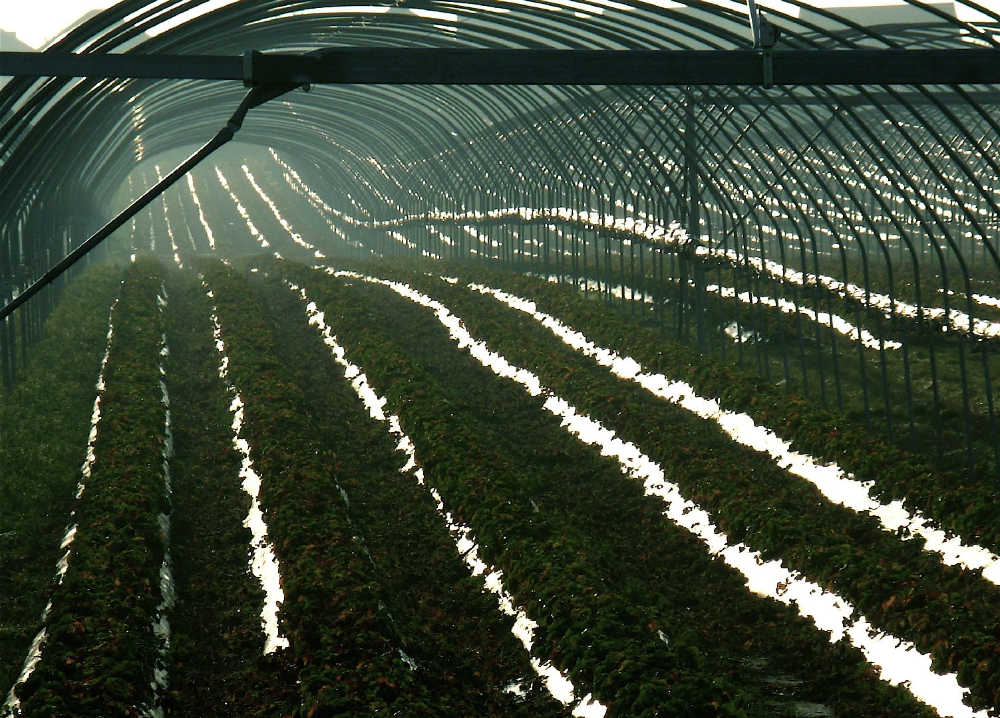

<link rel="stylesheet" href="https://cdn.jsdelivr.net/npm/justifiedGallery@3.8.1/dist/css/justifiedGallery.css" />
<link rel="stylesheet" href="https://cdn.jsdelivr.net/npm/lightgallery@2.7.0/css/lightgallery.css" />
<link rel="stylesheet" href="https://cdn.jsdelivr.net/npm/lightgallery@2.7.0/css/lg-thumbnail.css" />
<link rel="stylesheet" href="https://cdn.jsdelivr.net/npm/lightgallery@2.7.1/css/lg-zoom.css">
<link rel="stylesheet" href="../../style/lg-image.css">

    <a href="specimen.jpg"
        data-slide-name="specimen"
        data-sub-html="

            <h4>specimen ⚪标本</h4>
            
img by <a href='https://www.flickr.com/photos/peripateticpurlieu/'>Peripatetic Purlieu</a> on <a href='https://www.flickr.com/photos/peripateticpurlieu/52590905484' target='_blank' rel='noopener'>flickr</a> / <a href='https://creativecommons.org/licenses/by-nc-nd/2.0/' target='_blank' rel='noopener'>cc by-nc-nd 2.0</a>

        
">
        
    </a>
	<a href="laguna/telecommunications_tower.jpg"
        data-slide-name="telecommunications_tower"
        data-sub-html="

			<h4>telecommunications tower ⚪电讯塔</h4>
			
img by <a href='https://www.flickr.com/photos/stratman2/'>Stratman²</a> on <a href='https://www.flickr.com/photos/stratman2/51913142847' target='_blank' rel='noopener'>flickr</a> / <a href='https://creativecommons.org/licenses/by-nc-nd/2.0/' target='_blank' rel='noopener'>cc by-nc-nd 2.0</a>

        
">
        
    </a>
    <a href="laguna/buoy.jpg"
        data-slide-name="buoy"
        data-sub-html="

            <h4>buoy ⚪浮标 ⚫漂浮在一处 以指示水下物体的位置或标记通道 ⚫种类包括了有垂直条纹的船骸浮标,夜间作分界用的光浮标,抛给水中的人以提供浮力的救生浮标,表示紧急求救通信的潜艇救援浮标等</h4>
			
img by <a href='https://www.flickr.com/photos/dorieo21/' target='_blank' rel='noopener'>Jerónimo Roure</a> by <a href='https://www.flickr.com/photos/dorieo21/48024978771' target='_blank' rel='noopener'>flickr</a> / <a href='https://creativecommons.org/licenses/by-sa/2.0/' target='_blank' rel='noopener'>cc by-sa 2.0</a>

        
">
        
    </a>
    <a href="laguna/navigational_light.jpg"
        data-slide-name="navigational_light"
        data-sub-html="

            <h4>navigational light ⚪航行灯 ⚫用于表示夜间的船体的航行方向和大小 ⚫其中舷灯通常位于最高层甲板和驾驶室两侧 左舷红色 右舷绿色 ⚫尾灯白色 ⚫锚灯白色 位于桅顶 在锚泊时开启 ⚫桅灯位于雷达桅或信号桅 在水平内以每分钟50~70闪次环照 ⚫有潜水员水下作业时 或者工程船固定时在其三角区的顶端和不通航一侧显示红灯 可通航一侧显示白灯 船只失控时挂2盏红灯 搁浅时加1盏锚灯 拖带时开启2~3盏白灯 ⚫另外 快船配有黄色桅灯 海巡船配有红色警示灯</h4>
			
img by <a href='https://www.royan.com.ar/' target='_blank' rel='noopener'>Jorge Royan</a> on <a href='https://commons.wikimedia.org/wiki/File:Detail_of_a_1800%27s_small_sailboat_deck,_Auckland_-_1059.jpg' target='_blank' rel='noopener'>wikicommons</a> / 

        
">
        
    </a>
    <a href="laguna/carrot_cake_and_tea.jpg"
        data-slide-name="carrot_cake_and_tea"
        data-sub-html="

            <h4>carrot cake and tea ⚪胡萝卜蛋糕和茶 ⚫一款秋季肥皂 含橄榄油,椰子油,雪亚树油,鳄梨油,葡萄籽油 ⚪鳄梨 ⚫亚热带果实 需无霜,无风气候 具跃熟期(climacteric) 表皮绿色,棕色,紫色,黑色 果肉呈奶油状</h4>
			
img by <a href='https://www.flickr.com/photos/necrocake/' target='_blank' rel='noopener'>Marilyn Sherman</a> on <a href='https://www.flickr.com/photos/necrocake/3629376983/' target='_blank' rel='noopener'>flickr</a> / <a href='https://creativecommons.org/licenses/by/2.0/' target='_blank' rel='noopener'>cc by 2.0</a>

        
">
        
    </a>
    <a href="laguna/mail_rail.jpg"
        data-slide-name="mail_rail"
        data-sub-html="

            <h4>mail rail ⚪邮政铁路 ⚪To 给收件人 ⚪Cc 抄送给次要收件人 通常无需回应 ⚪Bcc 密送给其他收件人 通常是次要收件人不应获得密送收件人的身份 ⚫但取决于邮箱客户端 收件人有几率被暗示自己是密送收件人</h4>
			
img by <a href='https://www.flickr.com/photos/nigelmenzies/' target='_blank' rel='noopener'>nigelmenzies</a> on <a href='https://www.flickr.com/photos/nigelmenzies/48670892946/' target='_blank' rel='noopener'>flickr</a> / <a href='https://creativecommons.org/licenses/by-nc-nd/2.0/' target='_blank' rel='noopener'>by-nc-nd 2.0</a>

        
">
        
    </a>
    <a href="laguna/Migingo.jpg"
        data-slide-name="Migingo"
        data-sub-html="

            <h4>Migingo ⚪米金戈 ⚫崎岖不平的多岩小岛 起初仅有杂草,鸟,蛇 湖水水位下降后 海拔达10至15米 由于奇怪的轮廓 被本地向导形容为一只浮龟 往东200米是更大的乌辛戈(Usingo)岛 ⚫随着出口尼罗河鲈鱼等鱼种的利润攀升 渔民和鱼贩陆续迁来 这里成为了渔业中心 岛上有一座码头 一些酒吧,妓院 一间诊所,露天赌场 许多铁皮棚屋</h4>
			
.screenshot from <a href='https://www.mapbox.com/gallery/#standard' target='_blank' rel='noopener'>mapbox</a>

        
">
        
    </a>
    <a href="laguna/ceylon_tea.jpg"
        data-slide-name="ceylon_tea"
        data-sub-html="

            <h4>锡兰红茶 鸦片战争后 某苏格兰籍植物学家随军来到清国 受洋行协助 伪装成清廷官员行走在长江流域和武夷山区 许多红茶的母本之一的武夷山大红袍树苗 被装进沃德箱这种大玻璃箱子 途经上海 海运至印度加尔各答港 辗转到阿萨姆邦的种植园 数代之后 培育出了英式(大吉岭)红茶 ⚫英式茶分为茶园茶,产地茶,混合茶,调味茶 ⚫一些茶汤配方有洋甘菊(据说可用于胃痛,肠躁症 也是温和的催眠剂) 甜叶菊(具有抗炎,杀菌作用 可作甜味剂 也是温和的泻药) 百里香(可缓解呼吸道炎症 助睡眠,消化 可作漱口水) 咖啡豆茶(由咖啡植物的种子制成的汤药) 原产亚洲的枸杞 在东亚流行的人参(通常用作兴奋剂和咖啡因替代品) 苦荞(可作粮食茶,麦片,饼干,面条,面饼等) ⚫一次一杯添2克茶 用95度热水泡2分钟</h4>
        
">
        
    </a>
    <a href="laguna/pachamanca.jpg"
        data-slide-name="pachamanca"
        data-sub-html="

            <h4> 地锅 ⚫一种用热石头闷烤的传统秘鲁菜 ⚪pachamanca来源于克丘亚语pacha(地)和manka(锅) ⚫19世纪 一部分华工在奴隶贸易中被贩卖到秘鲁 囚禁于太平洋沿岸的钦查群岛 代替囚犯 作为挖掘鸟粪的主力 而鸟粪是当时秘鲁政府的主要出口营收 ⚫他们称呼这些岛为鸟粪岛 岛上环境恶劣至极 终年不雨 水源匮乏</h4>
			
img by <a href='https://www.flickr.com/photos/wassi/' target='_blank' rel='noopener'>der_aus_peru</a> on <a href='https://www.flickr.com/photos/wassi/559415205/' target='_blank' rel='noopener'>flickr</a> / <a href='https://creativecommons.org/licenses/by-nc-nd/2.0/' target='_blank' rel='noopener'>cc by-nc-nd 2.0</a>

        
">
        
    </a>
    <a href="laguna/Temple_of_Janus.jpg"
        data-slide-name="Temple_of_Janus"
        data-sub-html="

            <h4>temple of Janus ⚪双面神战争门 ⚫古罗马农历中一月的神灵 通常被描绘成有两张面孔 以其命名的建筑是两端设置大门的四方围墙 在和平年代 它的拱门保持关闭 ⚪janus起源于拉丁词根去 也跟janua(通道 门)有关 ⚫在新年,军事季节的起止等时候祭祀 不献祭动物时 会呈上小麦盐蛋糕 在夏至前一天 则是加牛奶和蜂蜜的车轮蛋糕 ⚫铭辞集(Epigrammata)第11卷第6章提到农神节有十四天</h4>
			
img by <a href='https://www.flickr.com/photos/peterjr1961/2301792094/' target='_blank' rel='noopener'>Peter Roan</a> on <a href='https://www.flickr.com/photos/peterjr1961/2301792094/' target='_blank' rel='noopener'>flickr</a> / <a href='https://creativecommons.org/licenses/by-nc/2.0/' target='_blank' rel='noopener'>cc by-nc 2.0</a>

        
">
        
    </a>
    <a href="laguna/laudanum.jpg"
        data-slide-name="laudanum"
        data-sub-html="

            <h4>laudanum ⚪劳丹姆 ⚪意为赞美 ⚫棕褐色 极苦 ⚫被当地的蔷薇十字会视为先知的帕那塞尔苏斯 本名菲利普斯·奥里欧勒斯·德奥弗拉斯特·博姆巴斯茨·冯·霍恩海姆 将炼金术的圣杯点金石置换为秘药阿卡那姆(archanum) 即罂粟碱鸡尾酒劳丹姆 该酊剂有着许多的合剂配方 ⚫古埃及人将它与没药,乳香同焚烧</h4>
			
img by <a href='https://www.sciencemuseum.org.uk/home' target='_blank' rel='noopener'>Science Museum</a> on <a href='https://wellcomecollection.org/works/c9k5r9tj' target='_blank' rel='noopener'>wellcomecollection</a> / <a href='https://creativecommons.org/licenses/by/4.0/' target='_blank' rel='noopener'>cc by 4.0</a>

        
">
        
    </a>
    <a href="laguna/diethylstilbestrol_1_mg_in_oil.jpg"
        data-slide-name="diethylstilbestrol_1_mg_in_oil"
        data-sub-html="

            <h4>diethylstilbestrol ⚪橄榄藻茴香 ⚫一些明火内脏烧烤会使用本地辣椒,蒜,盐,小茴香制酱 ⚪ampoule(安瓿) ⚫盛装药液的小型玻璃容器 ⚫最早多见于殉道者墓窟的陪葬品 盛放死者的血液样本 ⚫与提托诺斯(Tithonus)神话相仿 在变形(Metamorphoses)14章中 古玛叶安(Cumaean)萎缩到仅剩声线 保存于瓶罐中 据说她曾向卢修斯·塔奎尼乌斯·苏佩巴斯以300金的价格推销9本神谕书 在神秘主义中 其第8卷284-330的片段上帝之子耶稣基督 救世主 可应用古典密码学取出鱼这个词 意思是他可在深水域生存 存在于无罪的死亡深渊 另外 子在闪族语中是一个模糊,开放的概念 ⚫陶罐材质的安瓶可用蜡封口 这类粗蜡可混合各种比例的虫胶,松节油,树脂,白垩,灰泥,蜂蜡 用来封住厚海绵状的橡木树皮作的木栓瓶塞 质地较细的蜡则多用于封住文件 ⚫这种封装方式容易使蜡和所盛液体混合 因此应该可以使用高比例的树脂 如末药 来增添风味 ⚫在奥赛德第十卷中 女巫师瑟西(Circe)用混合了啤酒,葡萄酒,蜂蜜酒的奇怪饮料居刻翁(kykeon)迷倒了奥德修斯的船员 然后把他们全变成了猪 一说是混合了除蚤薄荷的大麦饮料 或者混入了有致幻作用的麦角菌 这种饮品在西阿提卡的埃琉西斯(Eleusis)秘仪 一种纪念德米特尔和普西芬妮的公共仪式的禁食环节饮用 ⚫秘仪的字面意思是狂欢 该词不曾出现在伊利亚特,奥德赛中 ⚫德泰佩勋爵描写她 雀斑脸颊 污迹蜿蜒</h4>
			
img by <a href='https://www.flickr.com/photos/diethylstilbestrol/' target='_blank' rel='noopener'>DES Daughter</a> on <a href='https://www.flickr.com/photos/diethylstilbestrol/26934675991' target='_blank' rel='noopener'>flickr</a> / <a href='https://creativecommons.org/licenses/by-nc-sa/2.0/' target='_blank' rel='noopener'>cc by-nc-sa 2.0</a>

        
">
        
    </a>
    <a href="laguna/aircraft_plywood.jpg"
        data-slide-name="aircraft_plywood"
        data-sub-html="

            <h4>aircraft plywood ⚪航空胶合板 ⚫由桃花心木,云杉,桦木粘合制成 具有提升的耐热性,耐湿性 ⚫在第二次世界大战期间应用于多用途的蚊式 它们无声地穿透了第三帝国夜空的雷达网 ⚫活树的年轮往往只能往前追溯100多年</h4>
			
img by <a href='https://www.flickr.com/photos/cheesyfeet/' target='_blank' rel='noopener'>-Cheesyfeet-</a> on <a href='https://www.flickr.com/photos/cheesyfeet/13926883713/' target='_blank' rel='noopener'>flickr</a> / <a href='https://creativecommons.org/licenses/by-nc-nd/2.0/' target='_blank' rel='noopener'>cc by-nc-nd 2.0</a>

        
">
        
    </a>
    <a href="laguna/plastic_agriculture.jpg"
        data-slide-name="plastic_agriculture"
        data-sub-html="

            <h4>plastic agriculture ⚪塑料农业 ⚫古代聚落的土地大致可分为三类 聚落边界内的精耕的园圃,与河道平行的生产主要作物的可灌溉土地,距水源较远的土地 ⚫后者通常用于放牧,收集燃料,狩猎 在条件适宜时 偶尔也用于间作</h4>
			
img by <a href='https://www.flickr.com/photos/addictive_picasso/' target='_blank' rel='noopener'>David Barrie</a> on <a href='https://www.flickr.com/photos/addictive_picasso/329358916/' target='_blank' rel='noopener'>flickr</a> / <a href='https://creativecommons.org/licenses/by/2.0/' target='_blank' rel='noopener'>cc by 2.0</a>

        
">
        
    </a>
    <a href="laguna/fractional_currency.jpg"
        data-slide-name="fractional_currency"
        data-sub-html="

            <h4>fractional currency ⚪小额货币 ⚪次级类贷款 ⚫借款人的还款能力出现明显问题 完全依靠其正常营业收入无法足额偿还贷款本息 即使执行担保 也可能会造成一定损失 ⚪信贷资产证券化 ⚫银行向借款人发放贷款 再将这部分贷款转化为资产支持证券出售给投资者 ⚪资产负债表 ⚫反映借款人在某一特定日期财务状况的财务报表 ⚪期货 ⚫提前约定货物,价格,交易时间的协议</h4>
			
img by <a href='https://www.flickr.com/photos/nationalmuseumofamericanhistory/' target='_blank' rel='noopener'>National Museum of American History Smithsonian Institution</a> on <a href='https://www.flickr.com/photos/nationalmuseumofamericanhistory/10480074673/' target='_blank' rel='noopener'>flickr</a> / <a href='https://creativecommons.org/licenses/by-nc/2.0/' target='_blank' rel='noopener'>cc by-nc 2.0</a>

        
">
        
    </a>
    <a href="laguna/sea_salt.jpg"
        data-slide-name="sea_salt"
        data-sub-html="

            <h4>海盐 ⚫参考1897年智利共和国地理词典(Diccionario Geográfico de la República de Chile de 1897)第88页 ⚪智利小村庄卡维尔(Cahuil) 名字来自当地的一种海鸥 同名的小海湾 长而曲折的泻湖在河流的尾端 此处湿地环绕 适合垂钓,划船,游泳 抓牡蛎,贻贝 这里有很少的居民 一所免费学校,邮政厅 一处社区教堂 ⚫到1978年时 卡维尔60%以上的人口定居在盐滩附近 ⚫到2008年 国家森林公司在该镇所辖的盐沼岛上新建了一个鸟类保护区 这里被认为是野鸭重要的觅食和筑巢地 ⚫在市政的乡村旅游案中 实习游客会去参观海盐的手工作业 或者玻璃,瓷器制作 也会到几处农民牧场用餐 ⚫该产业毗邻后根瘤蚜代酿酒葡萄的大产区 不同山谷的结果通常区别 有红浆果味,果酱味,桉树味,薄荷,胡椒等 ⚫湖盐可能有鱼虾的碎块 岩盐常混有粘土 ⚫粗糖的糖粒通常较大 带蜜糖风味</h4>
			
img by <a href='https://www.flickr.com/photos/ronaldc5/' target='_blank' rel='noopener'>Ronald van der Graaf</a> on <a href='https://www.flickr.com/photos/ronaldc5/14825339124/' target='_blank' rel='noopener'>flickr</a> / <a href='https://creativecommons.org/licenses/by/2.0/' target='_blank' rel='noopener'>cc by 2.0</a>

        
">
        
    </a>
    <a href="laguna/soap.jpg"
        data-slide-name="soap"
        data-sub-html="

            <h4>肥皂 一种脂肪酸盐 ⚫硫磺皂用于抑制皮脂,杀灭细菌,霉菌,寄生虫 适合某些轻微皮肤病及油性肤质 ⚫药皂多碱性 适于洗手或油性肤质 长期使用并不致菌群失调 但使皮肤易失水,干燥,脱皮 ⚫硼酸浴皂偏酸性 使用后皮肤无润滑感 ⚫胆汁肥皂混合了哺乳动物的胆汁 用于纺织品 在洗涤前几小时溶去坚硬污渍 ⚫盐水肥皂是钾基肥皂而不是钠皂 使用于海水,硬水 以及没有或需要保存淡水时 ⚫钠皂硬度高 适用于洗衣 ⚫市面上的盐皂在宣传时多围绕水疗体验,天然着色剂</h4>
        
">
        
    </a>

