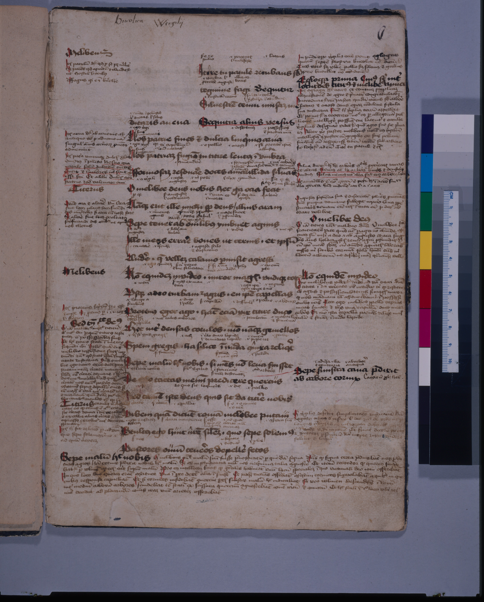
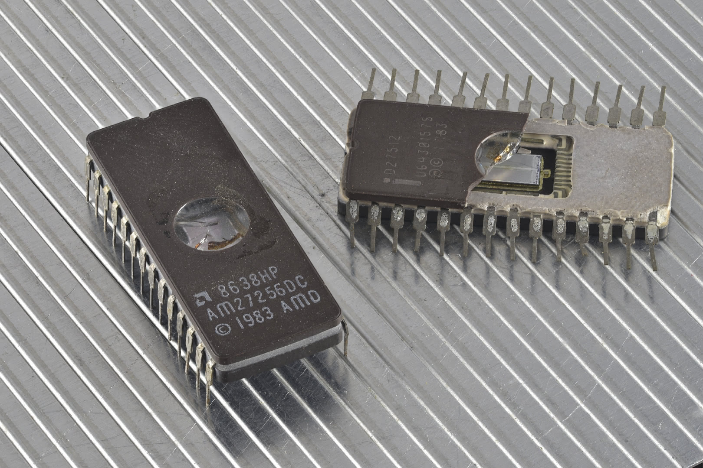
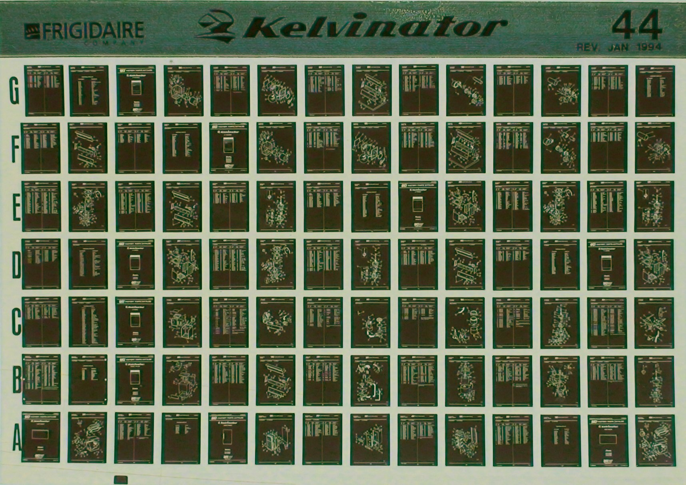

<link rel="stylesheet" href="https://cdn.jsdelivr.net/npm/justifiedGallery@3.8.1/dist/css/justifiedGallery.css" />
<link rel="stylesheet" href="https://cdn.jsdelivr.net/npm/lightgallery@2.7.0/css/lightgallery.css" />
<link rel="stylesheet" href="https://cdn.jsdelivr.net/npm/lightgallery@2.7.0/css/lg-thumbnail.css" />
<link rel="stylesheet" href="https://cdn.jsdelivr.net/npm/lightgallery@2.7.1/css/lg-zoom.css">
<link rel="stylesheet" href="https://cdn.jsdelivr.net/npm/tooltipster@4.2.8/dist/css/tooltipster.bundle.min.css" />
<link rel="stylesheet" href="https://cdn.jsdelivr.net/npm/tooltipster@4.2.8/dist/css/plugins/tooltipster/sideTip/themes/tooltipster-sideTip-light.min.css" />

    <a href="nineveh/Eclogues.jpg"
        data-sub-html="

            <h4>Eclogues</h4>
            
.img by <a href='https://www.flickr.com/photos/hopkinsarchives/' target='_blank' rel='noopener'>Special Collections at Johns Hopkins University</a> on <a href='https://www.flickr.com/photos/hopkinsarchives/10800825703/' target='_blank' rel='noopener'>flickr</a> / <a href='https://creativecommons.org/licenses/by/2.0/' target='_blank' rel='noopener'>cc by 2.0</a>

        
">
        
    </a>
    <a href="nineveh/eprom.jpg"
        data-sub-html="

            <h4>eprom ⚪可洗可烧写只读记忆体</h4>
            
.img by <a href='https://www.flickr.com/photos/sic66/' target='_blank' rel='noopener'>Martijn Boer</a> on <a href='https://www.flickr.com/photos/sic66/50786660562/' target='_blank' rel='noopener'>flickr</a> / <a href='https://creativecommons.org/publicdomain/mark/1.0/' target='_blank' rel='noopener'>pmd</a>

        
">
        
    </a>
    <a href="nineveh/Timaeus 32-33.jpg"
        data-sub-html="

            <h4>Stephanus pagination ⚪斯蒂芬奴斯页注</h4>
            
.img on <a href='https://archive.org/details/platonisoperaqua03plat/' target='_blank' rel='noopener'>Internet Archive</a> / <a href='https://creativecommons.org/publicdomain/mark/1.0/' target='_blank' rel='noopener'>pdm</a>

        
">
        
    </a>
    <a href="nineveh/First Delphic Hymn, 1st and 2nd verse.jpg"
        data-sub-html="

            <h4>first Delphic hymn, 1st and 2nd verse ⚪德尔菲圣歌第一首一二节</h4>
            
.img by <a href='https://commons.wikimedia.org/w/index.php?title=User:Michael_Nicht' target='_blank' rel='noopener'>Michael Nicht</a> on <a href='https://commons.wikimedia.org/wiki/File:First_Delphic_Hymn,1st_%26_2nd_verse.jpg' target='_blank' rel='noopener'>wikicommons</a> / <a href='https://creativecommons.org/licenses/by-sa/4.0/' target='_blank' rel='noopener'>cc by-sa 4.0</a>

        
">
        
    </a>
    <a href="nineveh/Souvenirs Entomologiques.webp"
        data-sub-html="

            <h4>Souvenirs Entomologiques昆虫纪念品</h4>
            
.img on <a href='https://gallica.bnf.fr/ark:/12148/bpt6k1522441v' target='_blank' rel='noopener'>bnf</a> / <a href='https://creativecommons.org/licenses/publicdomain/' target='_blank' rel='noopener'>pdm</a>

        
">
        
    </a>
    <a href="nineveh/Nineveh, Colesville TP.jpg"
        data-sub-html="

            <h4>Nineveh(Colesville TP) ⚪尼尼微</h4>
            
.img by <a href='https://nypl.getarchive.net/' target='_blank' rel='noopener'>New York Public Library</a> on  / <a href='https://creativecommons.org/licenses/publicdomain/' target='_blank' rel='noopener'>pdm</a>

        
">
        
    </a>
    <a href="nineveh/Microform.jpg"
        data-sub-html="

            <h4>microform ⚪微缩型</h4>
            
.img by <a href='https://commons.wikimedia.org/wiki/User:Ianare' target='_blank' rel='noopener'>Ianare</a> on <a href='https://commons.wikimedia.org/wiki/File:Microfiche_card.JPG' target='_blank' rel='noopener'>wikicommons</a> / <a href='https://creativecommons.org/licenses/by-sa/2.5/' target='_blank' rel='noopener'>cc by-sa 2.5</a>

        
">
        
    </a>
    <a href="nineveh/Gortys Law Code.jpg"
        data-sub-html="

            <h4>Gortys law code ⚪格尔蒂法典</h4>
            
.img by <a href='https://commons.wikimedia.org/wiki/User:Afrank99' target='_blank' rel='noopener'>Afrank99</a> on <a href='https://commons.wikimedia.org/wiki/File:Gortys_Law_Code.jpg' target='_blank' rel='noopener'>wikicommons</a> / <a href='https://creativecommons.org/licenses/by-sa/2.5' target='_blank' rel='noopener'>cc by-sa 2.5</a>

        
">
        
    </a>
    <a href="nineveh/Venus tablet of Ammisaduqa.jpg"
        data-sub-html="

            <h4>Venus tablet of Ammisaduqa ⚪阿米萨杜卡金星泥板</h4>
            
.img by <a href='https://research.britishmuseum.org/research/collection_online/collection_object_details/collection_image_gallery.aspx?partid=1&assetid=651644001&objectid=314745' target='_blank' rel='noopener'>the British Museum</a> / <a href='http://creativecommons.org/licenses/by-nc-sa/4.0/' target='_blank' rel='noopener'>cc by-nc-sa 4.0</a>

        
">
        
    </a>
    <a href="nineveh/Subject Catalogue.jpg"
        data-sub-html="

            <h4>subject catalogue ⚪主题目录</h4>
            
.img by Dr. Marcus Gossler on <a href='https://commons.wikimedia.org/wiki/File:Schlagwortkatalog.jpg' target='_blank' rel='noopener'>wikicommons</a> / <a href='https://creativecommons.org/licenses/by-sa/3.0/' target='_blank' rel='noopener'>cc by-sa 3.0</a>

        
">
        
    </a>
    <a href="nineveh/Punched Cards.jpg"
        data-sub-html="

            <h4>punched cards ⚪打孔卡</h4>
            
.img by <a href='https://www.flickr.com/people/8399025@N07' target='_blank' rel='noopener'>Marcin Wichary</a> on <a href='https://www.flickr.com/photos/8399025@N07/2210753092' target='_blank' rel='noopener'>flickr</a> / <a href='https://creativecommons.org/licenses/by/2.0/' target='_blank' rel='noopener'>cc by 2.0</a>

        
">
        
    </a>

