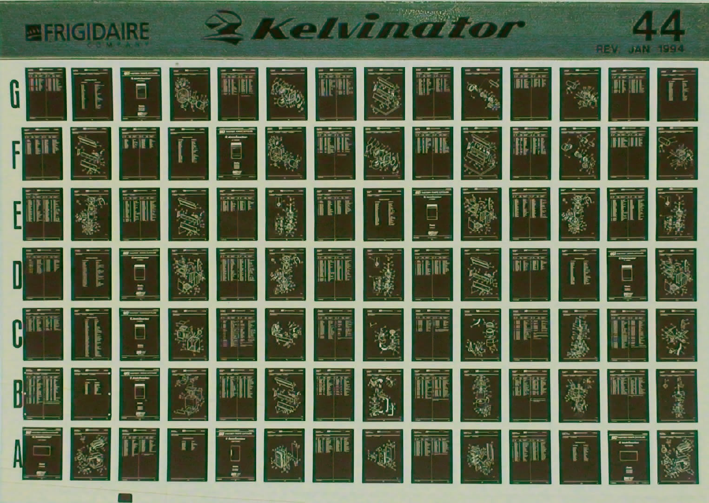

<link rel="stylesheet" href="https://cdn.jsdelivr.net/npm/justifiedGallery@3.8.1/dist/css/justifiedGallery.css" />
<link rel="stylesheet" href="https://cdn.jsdelivr.net/npm/lightgallery@2.7.0/css/lightgallery.css" />
<link rel="stylesheet" href="https://cdn.jsdelivr.net/npm/lightgallery@2.7.0/css/lg-thumbnail.css" />
<link rel="stylesheet" href="https://cdn.jsdelivr.net/npm/lightgallery@2.7.1/css/lg-zoom.css">
<link rel="stylesheet" href="../../style/lg-image.css">

    <a href="nineveh/47_animal_sounds_over_and_over.jpg"
        data-slide-name="47_Animal_Sounds_Over_and_Over"
        data-sub-html="

            <h4>47 Animal Sounds Over and Over</h4>
            
img on <a href='http://imagequilts.com/' target='_blank' rel='noopener'>imagequilts</a>

        
">
        
    </a>
    <a href="nineveh/Eclogues.jpg"
        data-slide-name="Eclogues"
        data-sub-html="

            <h4>Eclogues ⚫草中有蛇潜行</h4>
            
img by <a href='https://www.flickr.com/photos/hopkinsarchives/' target='_blank' rel='noopener'>Special Collections at Johns Hopkins University</a> on <a href='https://www.flickr.com/photos/hopkinsarchives/10800825703/' target='_blank' rel='noopener'>flickr</a> / <a href='https://creativecommons.org/licenses/by/2.0/' target='_blank' rel='noopener'>cc by 2.0</a>

        
">
        
    </a>
    <a href="nineveh/eprom.jpg"
        data-slide-name="eprom"
        data-sub-html="

            <h4>eprom ⚪可洗可烧写只读记忆体 ⚫烧一词最早用在一次性烧写(otp)芯片上 写入时所需的高电压会永久改变其中的物理组成 来实现逻辑 ⚫进行擦除时 需要透过外包装顶部的非结晶石英窗 将硅芯暴露在强紫外光下 ⚫在一篇论文里 数学家艾伦·图灵(Alan Turing)描述了一种假设的机器 现被称为通用图灵机 它有着一个无限的储存区 今天的术语是随机访问记忆体(ram) ⚫随机访问指信息读写时无关读写顺序,物理位置 ⚫不同于只读记忆体(rom) 经断电后 指令,数据的载体将释放 ⚫这种储存器是线形编址的 映射该物理记忆体内散列的地址到虚拟化的连续的地址 也就是从栈(frame)到页 就是一个简单页表(page table) ⚪pages ⚪页</h4>
            
img by <a href='https://www.flickr.com/photos/sic66/' target='_blank' rel='noopener'>Martijn Boer</a> on <a href='https://www.flickr.com/photos/sic66/50786660562/' target='_blank' rel='noopener'>flickr</a> / <a href='https://creativecommons.org/publicdomain/mark/1.0/' target='_blank' rel='noopener'>pmd</a>

        
">
        
    </a>
    <a href="nineveh/Timaeus_32-33.jpg"
        data-slide-name="Timaeus_32-33"
        data-sub-html="

            <h4>Stephanus pagination ⚪斯蒂芬奴斯页注 ⚫一套关于柏拉图著作柏拉图集的引用标准 以希腊语学者和印刷商人亨利·艾蒂安(亨里库斯·斯蒂芬奴斯)出版的三卷双语对照本为基准 每页分成古希腊语,拉丁语双栏 每栏5个小节 以拉丁字母abcde指代 ⚫因为每卷页码都从1计数 所以引用小节时需指明著作 如位于第三卷的会饮篇172页第1段可写成Symposium172a ⚫因为附有批注 部分页可能不能包含所有段落 ⚫另外在较长篇的理想国(Respublica),法律篇(Leges)的每章前 都附有导言 这部分的页码可视作冗余 ⚫在需要指明行数的情况下 通常以约翰·伯纳(John Burnet)的古希腊语五卷本为基准 如会饮篇第209页a小节5-9行可写成Symposium209a5–9或者缩写成Pl.Symp.209a5–9 ⚫对比下 贝克尔(Bekker)页注基于普鲁士科学院版的亚里士多德集 也就是由古典语言学家奥古斯特·伊曼努尔·贝克(August Immanuel Bekker)所编辑 在编号时不进行循环 每页用ab指第一栏和第二栏 作为符号系统 它是紧凑而确切的 尽管依赖著作版本 ⚫面向业余爱好者发行精简版本是有效的图书营销技巧</h4>
            
img on <a href='https://archive.org/details/platonisoperaqua03plat/' target='_blank' rel='noopener'>Internet Archive</a> / <a href='https://creativecommons.org/publicdomain/mark/1.0/' target='_blank' rel='noopener'>pdm</a>

        
">
        
    </a>
    <a href="nineveh/First_Delphic_Hymn,_1st_and_2nd_verse.jpg"
        data-slide-name="irst_Delphic_hymn,_1st_and_2nd_verse"
        data-sub-html="

            <h4>first Delphic hymn, 1st and 2nd verse ⚪德尔菲圣歌第一首一二节 ⚫第二节案文如下 看那 大城和阿提卡正在祈祷 特托尼亚女神戒戎下 不倾之地的居民 圣坛上 赫菲斯托斯享用了牛犊腿股 阿拉伯焚香同这烟升起 悠扬音符 被尖削,彻响的奥罗斯管编捻成旋律 由金颤的,悦耳的基塔拉琴纺织 这赞歌</h4>
            
img by <a href='https://commons.wikimedia.org/w/index.php?title=User:Michael_Nicht' target='_blank' rel='noopener'>Michael Nicht</a> on <a href='https://commons.wikimedia.org/wiki/File:First_Delphic_Hymn,1st_%26_2nd_verse.jpg' target='_blank' rel='noopener'>wikicommons</a> / <a href='https://creativecommons.org/licenses/by-sa/4.0/' target='_blank' rel='noopener'>cc by-sa 4.0</a>

        
">
        
    </a>
    <a href="nineveh/Souvenirs_Entomologiques.jpg"
        data-slide-name="Souvenirs_Entomologiques"
        data-sub-html="

            <h4>Souvenirs Entomologiques ⚪昆虫纪念品 ⚫1923年 周作人在报章上发表法布尔昆虫记并从英,日文转译了数章 ⚫晚年 翻译了小约翰的周树人有意转译全本 但不果</h4>
            
img on <a href='https://gallica.bnf.fr/ark:/12148/bpt6k1522441v' target='_blank' rel='noopener'>bnf</a> / <a href='https://creativecommons.org/licenses/publicdomain/' target='_blank' rel='noopener'>pdm</a>

        
">
        
    </a>
    <a href="nineveh/Nineveh,_Colesville_TP.jpg"
        data-slide-name="Nineveh,_Colesville_TP"
        data-sub-html="

            <h4>Nineveh(Colesville TP) ⚪尼尼微 ⚫部分教徒认为是圣经中描述的大城的部分 即创世纪中 他从那地出来往亚述去 建造尼尼微,利河伯,迦拉 和尼尼微,迦拉中间的利鲜 这就是那大城 ⚫考古学家莱亚德评论 若将尼姆鲁德(迦拉),库扬积(尼尼微),科萨巴 和卡兰里斯四大土丘视作矩形的四角 四边长恰巧相等于地理学家所说的480斯达地(stadia)或96公里 这就是约拿先知说要走三天才走得完的路程 ⚫小先知书里 约拿很可能将这几处地方视为一个大城 并以创世纪10:11最先提及的城市称呼它 即异邦尼尼微 ⚫该城废墟中发现过一个象牙质的天文单位表的菱柱 最初被认为是描述游戏规则 ⚫供电片区的划分中 地级市高负荷密度区属A类 地级市市中心区属B类 地级市市区,县城属C类 乡村,农林场属D类</h4>
            
img by <a href='https://nypl.getarchive.net/' target='_blank' rel='noopener'>New York Public Library</a> on  / <a href='https://creativecommons.org/licenses/publicdomain/' target='_blank' rel='noopener'>pdm</a>

        
">
        
    </a>
    <a href="nineveh/Microform.jpg"
        data-slide-name="Microform"
        data-sub-html="

            <h4>microform ⚪微缩型 ⚫母本多为印刷型 可能包含声像型的转写本 如乐谱 ⚫存档的储存内容有如 法庭卷档,庄园账簿,调查清册,报道,法规,禁令材料 风俗,游戏,节庆文献等存档 诗,诙谐故事,短篇小说,世俗剧,宗教剧体裁等文本 ⚫插图,传单,时装,肖像,附图等美术作品 常见行旅征战,童仆嬉闹,圣经故事,劝世讽人等内容</h4>
            
img by <a href='https://commons.wikimedia.org/wiki/User:Ianare' target='_blank' rel='noopener'>Ianare</a> on <a href='https://commons.wikimedia.org/wiki/File:Microfiche_card.JPG' target='_blank' rel='noopener'>wikicommons</a> / <a href='https://creativecommons.org/licenses/by-sa/2.5/' target='_blank' rel='noopener'>cc by-sa 2.5</a>

        
">
        
    </a>
    <a href="nineveh/Gortys_Law_Code.jpg"
        data-slide-name="Gortys_law_code"
        data-sub-html="

            <h4>Gortys law code ⚪格尔蒂法典 ⚫涉及了婚约,继承法等 没有关于刑法,商法的条款 早期的法典一般用来编纂当时行为规范和惯例 ⚫在约翰福音19:23-24中 提到耶稣有件没有缝口的衣服 可能是约亚拿赠送 这份财产来源于父亲去世时无儿而由女儿继承的遗产,所受赠予,离婚赡养费,丈夫的遗产中的生活费,个人收入 ⚫在第3千纪末的埃什南纳(Eshnunna)法典里 罗列了银兑换货品的一般价格 并规定当收获季节结束时 必须返回借去的等重量的金属 即使这些工具成为残片 它们将在寺庙或宫廷的作坊里熔化并重新锻造</h4>
            
img by <a href='https://commons.wikimedia.org/wiki/User:Afrank99' target='_blank' rel='noopener'>Afrank99</a> on <a href='https://commons.wikimedia.org/wiki/File:Gortys_Law_Code.jpg' target='_blank' rel='noopener'>wikicommons</a> / <a href='https://creativecommons.org/licenses/by-sa/2.5' target='_blank' rel='noopener'>cc by-sa 2.5</a>

        
">
        
    </a>
    <a href="nineveh/Venus_tablet_of_Ammisaduqa.jpg"
        data-slide-name="Venus_tablet_of_Ammisaduqa"
        data-sub-html="

            <h4>Venus tablet of Ammisaduqa ⚪阿米萨杜卡金星泥板 ⚫也是埃努马·阿努·伊利尔第63碑(Enuma Anu Enlil Tablet 63) 由划分了黄道宫的旧巴比伦人所著 是最古老的天文学著作 但可能存在同期或更古老的口头占星传统 ⚫泥板由湿润粘土书写后再烧制 记录或转抄卖地,转让果园等的合同泥板可能有4x6厘米大小 ⚫泥板也称陶片 据陶片放逐法 雅典人可在碎陶瓷刻上名字 每年放逐一名城邦公民 ⚫大多的原始黏土需要经提纯,风干,过滤 去除杂质,气泡 与其他黏土,矿物混合 形成坯体,湿黏土 以获得特殊的颜色,可塑性</h4>
            
img by <a href='https://media.britishmuseum.orgimages/Repository/Documents/2014_10/11_13/f3c6c404_8593_40a1_afe0_a3c100ddddd4/mid_00651644_001.jpg' target='_blank' rel='noopener'>the British Museum</a> / <a href='http://creativecommons.org/licenses/by-nc-sa/4.0/' target='_blank' rel='noopener'>cc by-nc-sa 4.0</a>

        
">
        
    </a>
    <a href="nineveh/Subject_Catalogue.jpg"
        data-slide-name="Subject_Catalogue"
        data-sub-html="

            <h4>subject catalogue ⚪主题目录 ⚫图书馆早期使用卡片来编目 卡片上记录馆藏品的某些元数据(metadata) 后者又称中继资料 ⚫馆中的藏品可能经常被商人,流亡者,朝圣者等旅客抄写,传播 ⚫参考大小为7.5x12.5厘米 ⚪中继(relay)器 ⚫用较小的电流去控制较大电流的一种开关 ⚫index源于拉丁语 意为指出的人,指示,食指 它的复数形式就是索引 ⚫特洛伊罗斯和克雷西达(Troilus and Cressida)I.3.344处的台本写到 这些索引 虽是小空洞 但对于后续卷章 可以窥见 巨大堆砌的幼形 大体上的将来 大律师和编目员诺曼·奈特对此评论 它约定了文学上的复数形式 把它们留给数学家来处理 相似地 附录可给到解剖学家 ⚫博物馆的特征之一是 将物体,图像,文本从其制造,消费,所有,使用的场合移出</h4>
            
img by Dr. Marcus Gossler on <a href='https://commons.wikimedia.org/wiki/File:Schlagwortkatalog.jpg' target='_blank' rel='noopener'>wikicommons</a> / <a href='https://creativecommons.org/licenses/by-sa/3.0/' target='_blank' rel='noopener'>cc by-sa 3.0</a>

        
">
        
    </a>
    <a href="nineveh/Punched_Cards.jpg"
        data-slide-name="Punched_Cards"
        data-sub-html="

            <h4>punched cards ⚪打孔卡</h4>
            
img by <a href='https://www.flickr.com/people/8399025@N07' target='_blank' rel='noopener'>Marcin Wichary</a> on <a href='https://www.flickr.com/photos/8399025@N07/2210753092' target='_blank' rel='noopener'>flickr</a> / <a href='https://creativecommons.org/licenses/by/2.0/' target='_blank' rel='noopener'>cc by 2.0</a>

        
">
        
    </a>

