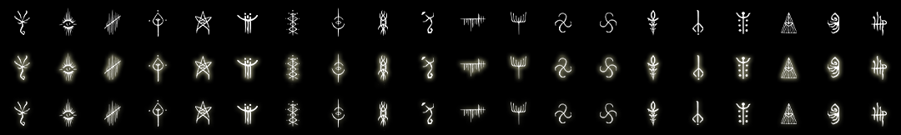
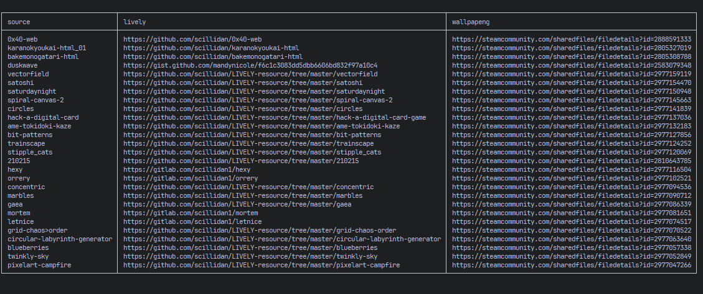
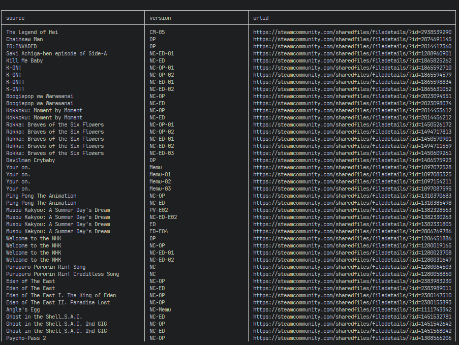
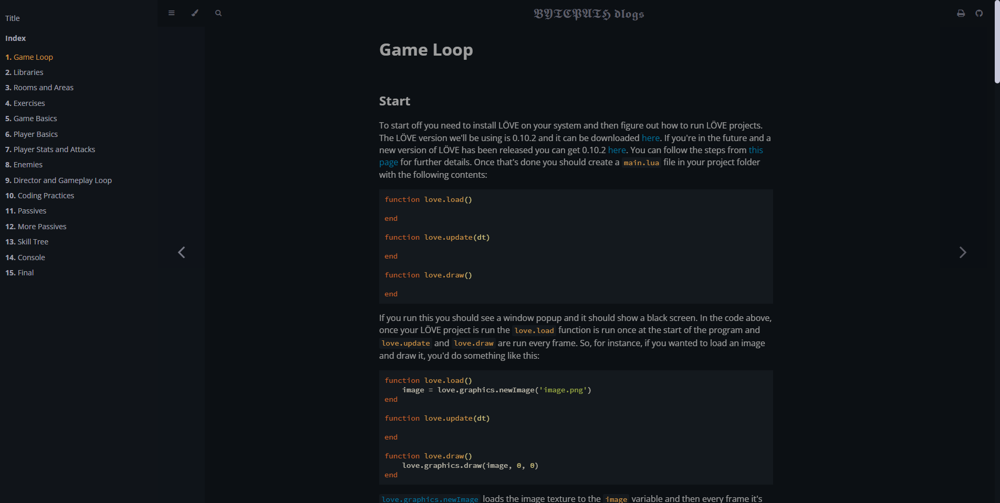
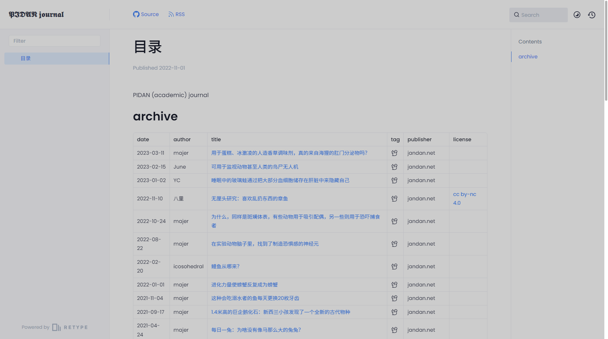
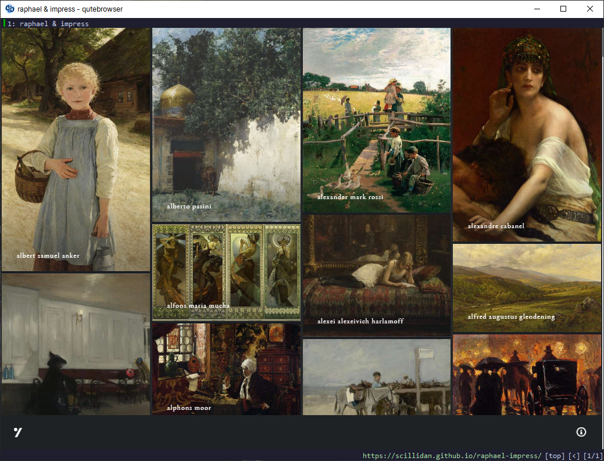

<link rel="stylesheet" href="https://cdn.jsdelivr.net/npm/justifiedGallery@3.8.1/dist/css/justifiedGallery.css" />
<link rel="stylesheet" href="https://cdn.jsdelivr.net/npm/lightgallery@2.7.0/css/lightgallery.css" />
<link rel="stylesheet" href="https://cdn.jsdelivr.net/npm/lightgallery@2.7.0/css/lg-thumbnail.css" />
<link rel="stylesheet" href="https://cdn.jsdelivr.net/npm/lightgallery@2.7.1/css/lg-zoom.css">

    <a href="repo/OPEN-SHELL-source.png"
        data-sub-html="

            <h4>OPEN-SHELL-source</h4>
            
<a href='https://github.com/scillidan/OPEN-SHELL-source' target='_blank' rel='noopener'>github</a>

        
">
        
    </a>
    <a href="repo/LIVELY-resource.png"
        data-sub-html="

            <h4>LIVELY-resource</h4>
            
<a href='https://github.com/scillidan/LIVELY-resource' target='_blank' rel='noopener'>github</a>

        
">
        
    </a>
    <a href="repo/WALLPAP-ENG-resource.png"
        data-sub-html="

            <h4>WALLPAP-ENG-resource</h4>
            
<a href='https://github.com/scillidan/WALLPAP-ENG-resource' target='_blank' rel='noopener'>github</a>

        
">
        
    </a>
	<a href="repo/BYTEPATH-blogs.png"
        data-sub-html="

			<h4>BYTEPATH-blogs</h4>
			
<a href='https://github.com/scillidan/BYTEPATH-blogs' target='_blank' rel='noopener'>github</a>

        
">
        
    </a>
    <a href="repo/PIDAN-journal.png"
        data-sub-html="

            <h4>PIDAN-journal</h4>
            
<a href='https://github.com/scillidan/PIDAN-journal' target='_blank' rel='noopener'>github</a>

        
">
        
    </a>
    <a href="repo/raphael-impress.png"
        data-sub-html="

            <h4>raphael-impress</h4>
            
<a href='https://github.com/scillidan/raphael-impress' target='_blank' rel='noopener'>github</a>

        
">
        
    </a>

